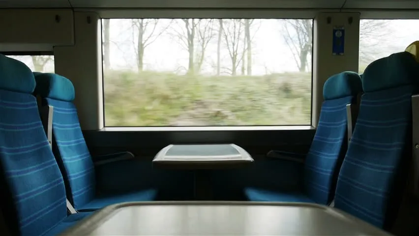

Ending an exhausting yet fulfilling adventure, I board the 3.35 back to České Budějovice. On this return leg of my journey, all the cabins in 2nd class seem to be occupied by at least one weary privacy-seeker. The travellers turn away my optimism all the way to the end of the carriage, and I take a seat in the last cabin containing, unsurprisingly, an occupant in one of the window seats.

He is wearing all black; he has a black jacket carelessly placed on the rack, a black satchel bag saying “Just Do Nothing” in bright colours, and a square white cardboard box resting on the small shelf overhanging the space between us. He has a stern look on his face and the only interaction between us was his curtly nod to my hesitant questioning look just prior to my invasion of his cabin.

***

I am mildly surprised as he gets up to leave, as I spuriously assumed him to be accompanying me to Budějce. Anyway, that’s the end of that. As the train slows down and approaches the next stop---a quaint little village called Roudná offering a lively view bursting with colour, in contrast with the erstwhile monochrome winter landscapes---I notice a girl, probably around my age, start moving towards the train. She has on a maroon top, and is holding a bright blue and green rain jacket in her arms. Do I see the subtlest smile on her eager face?

As I turn my attention back to my Kindle, my peripherals catch sight of some text---white, against a red background---”Just Do Nothing”. I look up to see the two of them walking hand-in-hand, with a spring in their steps. Auburn hair and maroon top settle gently but earnestly upon the firm black. He opens the box, and by now they have left behind the inviting pink station walls and the tiny brown shed to savour the contents of the mysterious box amidst the flashing cover of the woods, protected from my spellbound yet intruding eyes.

 

