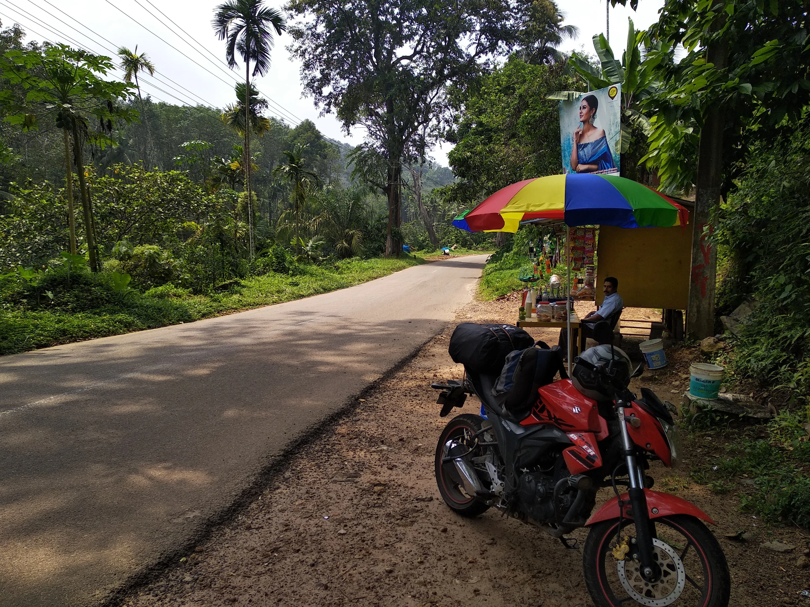

I am at home on the road, helmet-clad.

I am tripping, yet in tune with the world. I am one with myself and my machine.

Detached from my normal life, from the rat race, from the mundane tasks. A simple switch of lenses; wide-angle to macro---a narrow but crisp and focussed field of vision.

Attached to the present---to the self and the machine, and to the world. Attached to being alive, to feeling, and to exploring. The thrill of wanderlust: the adrenaline- and dopamine-fuelled ecstasy; and the sedated high that numbs out the inconsequential. A narcotic? Perhaps.

As I suit up and hit the road, leaving behind the chaos of the city, I also leave behind any associated preoccupations. I am in a different realm---one with no enforcer. Carefree, but not truly; with all the solitude that comes with the throttle, I am constantly reminded of another entity at the helm. Being at the mercy of luck, of my machine, and of other denizens of the road. Yet, there is a certain magic in accepting this dichotomy of control. It is a humbling emotion that allows me to truly cherish every single moment. It not only solidifies my faith in my own abilities, but also reassures me of the beauty in aimlessness.

Honestly, the banal romanticism of the bond between one and one’s machine is justified. It really is no wonder, given the considerable amount of time spent together in close quarters. It is a relationship stronger than most others in one’s life. A relationship based on mutual trust and reliance. Where each party wants the best for the other. Endlessly seeking adventure as one, striving for reflections and revelations. A yearning for experiences that metamorphose with time into memorable tales.

Stepping out from the routine, I find a remarkable value in the ephemeral. Being habituated with dealing with the same people and the same things day in and day out, I start seeking the trivial. Suddenly, the sweet scent of [*pazhampori*](https://www.tastycircle.com/recipe/pazham-pori/) mixed with petrichore wafting into the dingy confines of a [*thattukada*](https://www.urbandictionary.com/define.php?term=thattukada) in the middle of nowhere becomes unforgettable. A Naseer-*ikka* selling lemon soda under a parasol becomes a friend for life. A horny man’s obscene requests vandalising the walls of a room help relieve my mind from the warranted nighttime fear of a bedbug attack. The conversations once had with cicadas and warblers on my favourite stretch of road: impossible to find again, yet heard forever. A burning urge to find out what happened to the taciturn old man who once sold cigarettes and sip-ups in a tiny shop close to the echoes of a vociferous brook.

It is a far-away realm, yet I am at home on the road, helmet-clad.

 

<figure>
    
    <figcaption>Naseer-<i>ikka</i> under a parasol&mdash;Anappara (near Ponmudi)</figcaption>
</figure>
