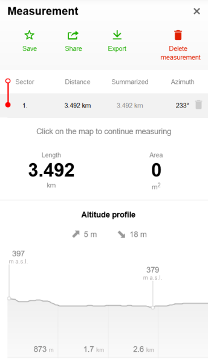
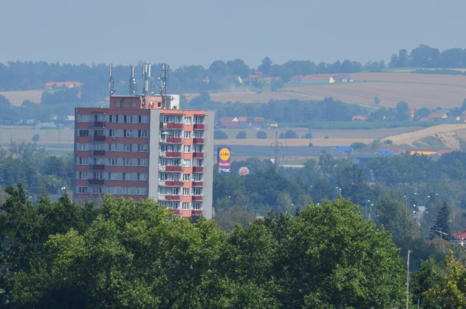

The other day, I was sitting at my desk as usual and occasionally looking out from my seventh-storey window onto the midday cityscape, when something suddenly caught my eye.

It was something located around two-thirds of the way between me and the horizon. I immediately recognised it to be some sort of a signboard, seemingly hoisted proudly above its neighbours and towered over only by a handful of nearby communist apartment buildings. Following this, it took hardly a moment for me to guess---from the vague yellow circle with a dark border that was visible to me---that it was the signboard of the supermarket chain, Lidl.

This in itself is nothing extraordinary, but I was surprised at how sure I was of my guess. I quickly picked up my binoculars and saw that it was indeed Lidl. However, I also saw a Burger King sign right beside it, as well as one of Budějovický Budvar a little ways away, two or three times bigger (and which usually lights up in neon red at night).

 

Now, keep in mind that the city of České Budějovice lies in a basin and is spread mostly across a plain, and hence is very flat. So the signboard I saw seemed incredibly far away. Also keep in mind that I have never been to Lidl, and have only seen the logo here and there. I wanted to find out how far exactly it was, so I managed to locate the one in question out of the three in the city, and measured the aerial distance to my position.

My mathematics is so rusty that I pointlessly went to sines and cosines at first, before realising Pythagoras would suffice. Finally, I realised that the 17.5 metres of height is really inconsequential to the base of 3500 metres, and so the hypotenuse would remain pretty much as 3500 metres.

Standing on the ground on a flat surface, humans can see an edge as far as ~5km away. This obviously increases as you observe from higher positions. But what I find amusing is that I was able to correctly identify the supermarket in less than a second, on seeing its signboard from 3.5km away, given that I was unable to notice the even bigger and closer to heart Budějovický Budvar. 

How many other occupants of communist buildings notice the Lidl signboard? If this isn’t marketing at its finest, then what is?

PS: I came across [an interesting article](https://chem.tufts.edu/answersinscience/relativityofwrong.htm) by Isaac Asimov, countering an English Lit major’s claim that modern knowledge is “wrong”. He uses examples like that of the curvature of the earth (how our knowledge evolved over time) to argue for his idea of the “relativity of wrong”.

> *"John, when people thought the earth was flat, they were wrong. When people thought the earth was spherical, they were wrong. But if you think that thinking the earth is spherical is just as wrong as thinking the earth is flat, then your view is wronger than both of them put together."*
>
> Isaac Asimov, *The Relativity of Wrong, The Skeptical Inquirer, Fall 1989, Vol. 14, No. 1, Pp. 35-44*