So. 2020 was a curious year. For me personally, it was a trial in many ways. An opportunity for deep learning and growth. Well, I suppose any year is, but 2020 was particularly so. And no, it is not due only to the pandemic. Even the content and style of this blog is going to change, so I thought it worthwhile to write up this post. It was a long (but short!) year and this is a long post, and since I am aware that not all of my vast readership might be interested in all the same things, I have graciously provided you the liberty of jumping ahead using the section headings in the sidebar.

## The Trial of 2020

I started off 2020 as a master’s student of ecology barely one semester into the programme. I had arrived in the Czech Republic for the master’s considering my time here almost as a [timeskip](https://tropedia.fandom.com/wiki/Time_Skip) separating two chapters of my life, and was determined to not go back home until the end of the two years. I even romanticised it (still do) and alluded to it in a poem. My first semester was enjoyable, with an assortment of Erasmus exchange students all here for the ecology programme. Needless to say, the first semester also saw a high degree of indulgence from my part, getting a taste of the “party culture” in the country of beer. However, the culture soon grew distasteful to me, and I got bored of it. So, the start of 2020 saw me leaning towards subtle reclusion, before the pandemic-enforced isolation.

A timeskip usually involves major changes in characters and storylines, and so it was for me. I was mainly here to get “stronger” (continuing the trope) in ecology and, more generally, science, but I was already focussing on that. The turn of the year saw me setting some goals which I hadn’t planned long in advance. Here, I’d first like to state that it is not that I subscribe to the gimmick of #newyearnewme, but that I love how a new year provides a clean slate for change, particularly how it makes tracking your progress much easier. For example, although I had had enough of smoking and had decided that I’d be quitting by November of 2019, I decided to wait until 01/01/2020 simply because it would help me stay on track easier (tracking progress motivates me to keep at it). And now, I can proudly (and quite effortlessly) say that I am 370 days free.

Right. So, at the turn of the year, I decided to use the next year to delve deep into writing, to put hours into the craft---they say it takes 10,000 hours to master anything---and to explore what exactly about it attracts me. I also wished to read widely and broaden my scope. Although things seemed vague and fuzzy at the time, I realise now that I was simply trying to understand myself and my interests. So, as the year went on, I also picked up some more things: a few fortuitous and immersive conversations led to the realisation that I am interested in philosophy; a transient wish to do my PhD in Japan along with my continued devotion to anime (One Piece FTW) pushed me to start learning Japanese officially (unofficial being the typical otaku’s “I know Japanese because I watch anime”); and a couple of other seemingly random events coming together which led me to indulge in serious birding like I’d never done before, providing further clarity to the undying dilemma of “is this what I really want to continue doing?”.

Looking at the year more broadly, however, the most important change (and the one that unites all the above together) is that I was able to discover what matters to me and what brings value to me. I’ve always been frugal with money, but this year really urged me to start handling my time like I’d handle my own money. This, as is wont with me, also tracks back to my sentiments regarding the stimulus-rich instant-gratification trap of a system that the world has come to be, but I shall spare you the pains of getting into that here. Put simply, I was able to identify a handful of things, activities, whatever, which truly provide value to me and which I would like to spend my time on regularly. One of them is obviously writing---in 2020 I explored the more literary side to writing, posting my poems and prose on the blog, and writing little else. This helped me figure out my passion for it, but from now I’d rather keep such pieces to myself, working on more of them privately, and instead switch to more regular and typically bloggish content on the blog. 

<figure>
    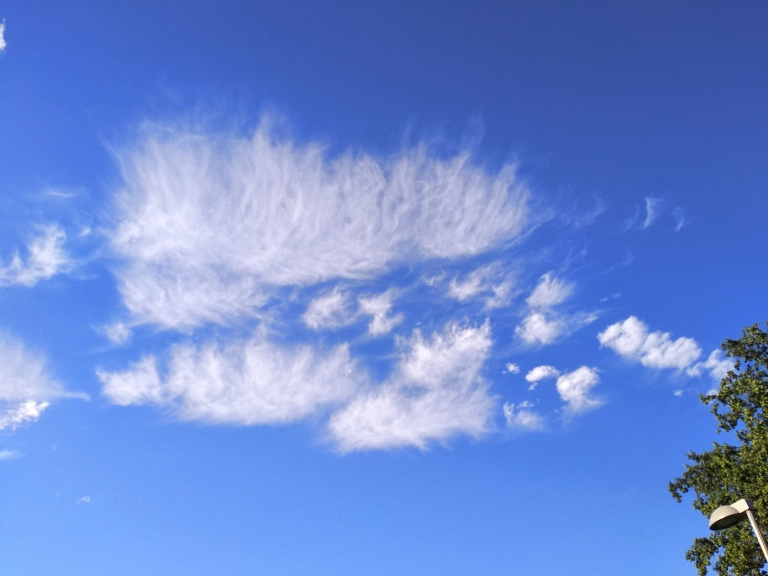
    <figcaption>Beautiful wispy clouds from South Bohemia.</figcaption>
</figure>

To summarise, 2020 was a successful and enlightening year for me from the personal growth perspective. It has transitioned quite smoothly into 2021, where I hope to continue the positive trend. Now to move past this boring personal talk, let’s go to a general summary of my 2020!

## The Year of 2020

January of 2020 saw most of the Erasmus friends I’d made in the first semester return to their respective home countries, on completing the semester. This wasn’t necessarily sad, because I was looking forward to meeting new people in the subsequent semesters. Oh boy, we all know how that went. I finished all the semester examinations and had sort of settled in to my life here. I had declined a friend’s suggestion/offer to visit Prague during Christmas as I was uninterested in the “holiday shopping”, and capital cities during holidays are seldom attractive. But by now, I was eager to start exploring places. Winter was a letdown, our town České Budějovice receiving hardly any snow throughout.

By February, I’d started to go around some of the local spots and bird infrequently (elaborated in the section below). I also started focussing more on “work”/studies, and was getting more and more excited about heading to Papua New Guinea for my thesis. To be honest though, I had avoided getting *too* excited so perhaps I was let off easy. March came around and so with it did the pandemic. We had offline classes in the second semester for a while until it was no longer safe. The “fieldwork season” was jeopardised but we still had hope for sometime in May. Near my birthday (24th March), I started re-watching One Piece, continuing from the Marineford Arc, because… Well, because it is the GOAT and I wanted to catch up to the manga. (I probably caught up sometime around May-June.) By the end of March, I had also formed this roughly weekly routine of birding with a labmate and postdoc, [Sreekar Rachakonda](https://scholar.google.co.in/citations?user=Cwj-h8gAAAAJ&hl=en&oi=ao), and the spring arrivals were ceaselessly fascinating (as was the rising tally of lifers)!

<figure>
    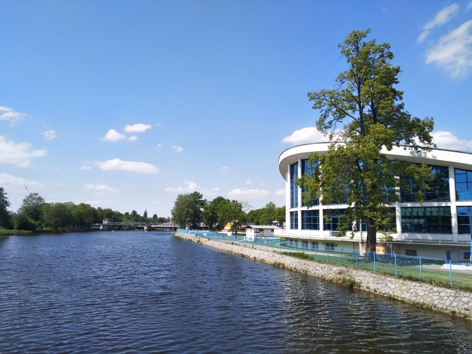
    <figcaption>The Vltava River as seen from close to the city centre.</figcaption>
</figure>

April saw pretty much nothing other than heavy birding, which continued into May until my supervisor [Katka](https://scholar.google.com/citations?user=8LJ8vLUAAAAJ&hl=en) and I realised that something serious would have to be done if I wanted to have a thesis project by the end of the master’s. We started planning for alternative project ideas. It didn’t help that I switched from working on odonates in PNG to birds in CZE, the peak season for birds in Europe almost at an end. I did manage to go on a couple of field trips during this period, like to the nearby national park Šumava, but there wasn’t any time to mourn the PNG plan. I was able to come up with something half decent in a couple of weeks, following which we proceeded to design the project and set everything up before I started fieldwork (data collection) with a colleague, [Inga](https://scholar.google.com/citations?user=8LJ8vLUAAAAJ&hl=en), in early July.

Then was a relatively monotonous period consisting of fieldwork two days in a week (which lasted till October), and room-work the other days. The pure wonder that came with spring had also fizzled out into the uneventful late summer, and I had gotten deeper into my academic work. I had received a bike for my fieldwork though, so I did cycle around at times. Most summer plans from the university were cancelled---including a week-long trip to the Baltic states which I had gotten selected for!---and it was slowly dawning on me that I had been in Czechia for close to a year and not been able to see much of the country. Then in late August, exactly 11 months after my arrival in the country, I decided to visit and explore Prague for the first time. It was a very memorable experience, though not for the conventional reasons. In early September, we managed to go on a multi-day trip to Křivoklát which was a welcome release to say the least. I also tasted for the first time one of my favourite Czech alcohols, [Burčák](https://thetravelbugbite.com/2020/08/14/burcak/). But otherwise, it was more of the same fieldwork, “work”/study, reading and birding. 

<figure>
    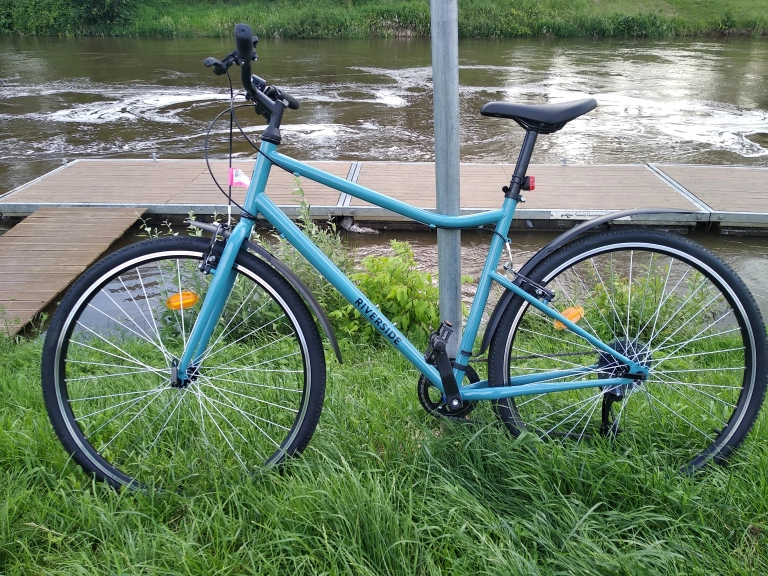
    <figcaption>My riverside Riverside.</figcaption>
</figure>

The first week of October saw the end of my fieldwork, and despite it not having been arduous at all, I felt slightly liberated. I sat for a while in that heady state until the [October Big Day](https://ebird.org/news/october-big-day-2020-bigger-than-ever), when I went all out and after which I fell sick (not with COVID) for about a week. This was particularly amusing, as I had come into contact with a COVID-positive person a couple of weeks prior, and had to get tested while I was sick from the Big Day. It turned out to be negative, of course. The third semester came around as well, unfortunately online again (except for the first week which was tantalisingly conducted offline) so lacking a new set of students to meet. Around this time I started planning additionally a small project in Copenhagen I’d gotten a scholarship for, so it was more room-work.

November saw a lot of bike trouble: the rear tyre kept deflating, and getting a new tube didn’t help. I eventually got frustrated and stopped using it (still need to get it fixed!). I also became an uncle. Because I wish to maintain a stoic facade, I will not talk much about it, save for the objective fact that she is a cutie. (See my poker face.) But the month also saw my first tooth extraction. I had been trying, since August, to see a dentist but the pandemic had just made the already troublesome dental situation in Czechia worse. I had two molars on either side which were decaying, and I finally decided to just get them removed from the public hospital. I was extremely nervous, as I didn’t even know if I’d be able to convey my message properly to the doctor, but everything turned out fine. I was by the second week of December a new man, and the Republic’s cache was now blessed with two of my (half-?)teeth.

December saw more of the same work, and the increasing guilt of not travelling enough. The Copenhagen project had to be postponed from the original January date. We received around 2 inches of snow on the 3rd, getting my hopes up high for this winter. I persuaded some of the professors to take us on a hike, after quite some time, and that was a fun day. Just as I had started making travel plans, on deciding that I will YOLO it from that point on (i.e., not care for COVID), new tighter regulations were slapped in place. Somehow, I was still able to make a small plan with a friend in Prague, [Sailee Sakhalkar](https://saileesakhalkar.wordpress.com/), and I spent a wonderful 3 days of Christmas in Prague (yes, ironic, though I didn’t do any “holiday shopping”), [Kutná Hora](https://www.lonelyplanet.com/czech-republic/kutna-hora) and the [Bohemian Switzerland](https://www.lonelyplanet.com/czech-republic/kutna-hora), witnessing a couple of tiny fortuities and accompanied by good conversation. I got back home after the trip and got all teary-eyed on reading One Piece Chapter 1000 which had unofficially just dropped then. The next day, I figured I had stayed away from my thesis long enough, and completed data entry (entered 6328 rows in 19 hours) just in time for the “happy” new year celebrations from friends. 

<figure>
    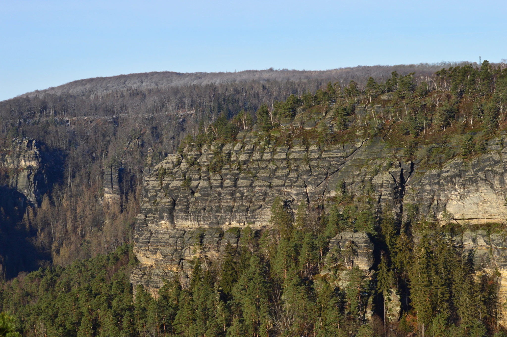
    <figcaption>České Švýcarsko National Park (Bohemian Switzerland)</figcaption>
</figure>

As I finish writing this I realise that I seem to have conveniently left out some of the more frustrating parts of the year. Go figure. This for me in 2020 was mainly getting caught in YouTube rabbitholes. (I do realise I am in a lucky position to have *this* be one of my biggest frustrations of the year.) I spent a lot of time, time I like to call MUWT (Mindless Un-intentional Waste Time), clicking from one video to the next, often watching things for the sake of it, in zombie-mode. It’s been from the start something I struggle with, but it has its ebbs and flows and it was especially aggravated in October-November when my fortitude was at its weakest (due to some personal reasons). On looking back, I can vaguely trace my Alice’s journey across the whole year, with the YouTube algorithm (and sometimes myself) taking me from productivity/self-improvement/personal finance/anime, which I subscribe to, to cricket to pranks to talk shows to standup comedy to I-don’t-know-what-to-call-it to Friends clips to short films to web series to old Malayalam movies to cars, until I eventually had to install a Firefox add-on that hides YouTube recommendations. So now, I follow only the channels I subscribe to, which really should be the way it works(!). And if there’s one thing I’ve learned from all this, it’s to make the distinction between chillax time and MUWT clear enough, and to be aware of it at all times.

That, very roughly, is how my 2020 went. It’s hard condensing a whole year’s worth of events into a few paragraphs, and I feel like I’ve skipped over half the things. Overall though, I can’t complain. My 2020 had a decently-sized bright side to it, especially the birding:

## Birding in 2020

2020 was a great year for me when it comes to birding. Although I had started birding in 2017 and I’d always enjoy identifying birds wherever I went, I’d never fully made it a part of my life. My friends and I would go on birding outings on weekends few and far in between and otherwise make the occasional bird list. That was it. But this year changed all of that.

<figure>
    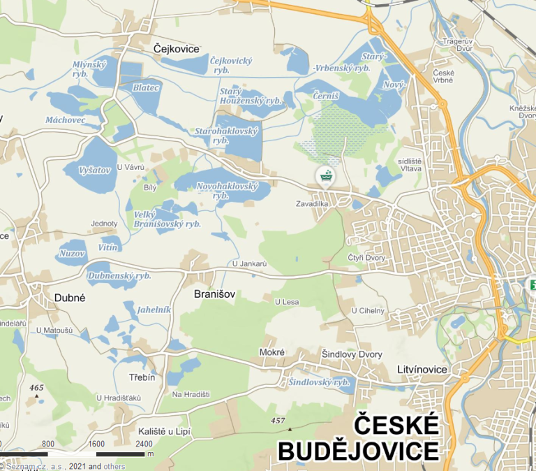
    <figcaption>The many fishponds close to the city centre. Screenshot from <a href="/">Mapy</a>.</figcaption>
</figure>

As mentioned earlier, I started birding again after the winter lethargy sometime in early February. eBird in Czechia was and still is in relatively early stages, which was something that excited me. I started off casually, still having a lot to learn about the calls and appearances of the species here. By March, I had built up some pace and mostly went around the university and to some spots nearby including a park. The city, České Budějovice, is unique because geographically it lies in a kind of basin which historically used to be marshy. The region (South Bohemia) has an extensive network of fishponds that are mostly for carp cultivation, but are great for waterbirds and shorebirds as well. On 14th March, I went on a spree, visiting most of the big ponds located within a 7-8 km radius of the university (see map). The fact that there are so many hotspots nearby, at a walking distance, really helped, as this was a big problem back when I was in Bangalore, where it’d take some money and at least an hour to get to a nice spot (and an hour back). I was a bit early for the spring arrivals, but got many lifers nevertheless, including the Northern Lapwing. I have a soft spot for lapwings ever since working on the Yellow-wattled in 2017. 

Soon after though, I happened to catch a small group of Lesser Redpolls one overcast morning right in the university campus. Unaware of the ID at the time, it was only when my first Czech friend [Honza Grünwald](https://www.instagram.com/birdwatchergw/) responded that I was elated, and I imagine that’s when the birding fever really got to me. I birded more regularly, and when the pandemic arrived towards the end of March, [Sreekar](https://ebird.org/profile/Mzc1NTI2/world) and I formed a mini team of two and started exploring (for) local hotspots. The migrants were arriving one by one, and both of us got at least one lifer on each of our trips. 

<figure>
    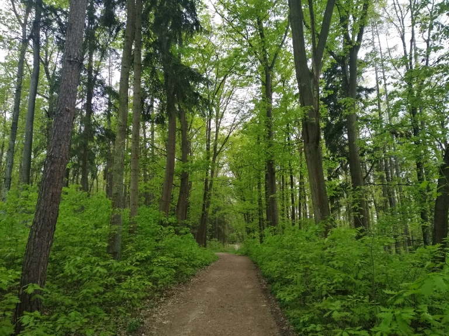
    <figcaption>The <a href="https://www.blesk.cz/clanek/zpravy-ufo-a-zahady/156767/zahadne-fotky-jsou-v-branisovskem-lese-duchove.html">“haunted”</a> Branišovský forest in peak spring.</figcaption>
</figure>

And I fell absolutely in love with warblers. Coming from southern India where the family has quite the bad rep, it was awesome seeing all the different species in their breeding attire (Wood Warbler, you beaut!), and their songs! Oh, I fell in love with their songs! I particularly love the *Locustella* warblers, named so for their songs which sound like the calls of locusts! During this period, I also started recording as many of these wonderful songs as I could, a habit which stuck with me even after spring. 

<iframe width="320" height="343" src="https://macaulaylibrary.org/asset/40170701/embed/320" frameborder="0" allowfullscreen style="width:320px;"></iframe>
<iframe width="320" height="371" src="https://macaulaylibrary.org/asset/229619701/embed/320" frameborder="0" allowfullscreen style="width:320px;"></iframe>

The months of April and May involved hardcore birding on foot (trips that sometimes went from dawn till dusk [12+ hours!], with a short stop at our favourite pub in Nové Dvory for lunch and beer), along with hours of training sessions learning calls and songs and hours of uploading checklists with photos and audio. I also visited some of the bigger fishponds around 20 km away with a German friend (the only new student that semester) which were normally hard for me to access, where I got to see some rarer species like Common Crane, Little Gull, Ruff and Black Tern and my FoS (first of season) Eurasian Golden Oriole. April particularly was a great month, with Sreekar and I having seen up to 92 species in a single day.

<figure>
    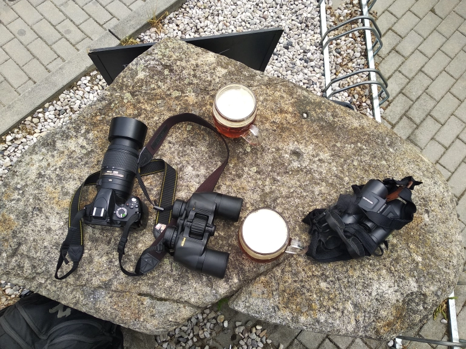
    <figcaption>Sreekar and I on our pitstop&mdash;gotta refuel! Global Big Day 2020.</figcaption>
</figure>

9th May was [Global Big Day](https://ebird.org/news/global-big-day-9-may-2020), and though we didn’t come anywhere near the top birders ([Honza](https://ebird.org/profile/OTIwMTgz) and his friends saw 161 species in 24 hours, a new Czech record), it was a lot of fun. I ended up with 80 species (#13 in the country) and 36 complete checklists. On the 16th of the same month, we twitched for a rare Pectoral Sandpiper and [were successful](https://ebird.org/checklist/S69131269). The Temminck’s Stints and Black-tailed Godwit we saw were sufficient to make our day, but the sandpiper was just perfect. We spotted it as soon as we arrived at the pond, and it let us get as close as 10m from it! It was a beautiful bird with a beak the colour of aged varnish, a sight for the ages. The bird is a rare vagrant this far into Europe (<10 records in CZ), being a regular sight on the other side of the Atlantic.

The spring buzz started dying down but birding went on, until I got busy with my thesis work, which required me to, well, watch birds. The weekend birding spree certainly ended, though. As a result, there wasn’t any spectacular sighting for a few months, especially as the birds had quieted down. Nevertheless, birding was still enjoyable, particularly when I went to new places, because for some reason the same birds in new locations are always exciting. 

<figure>
    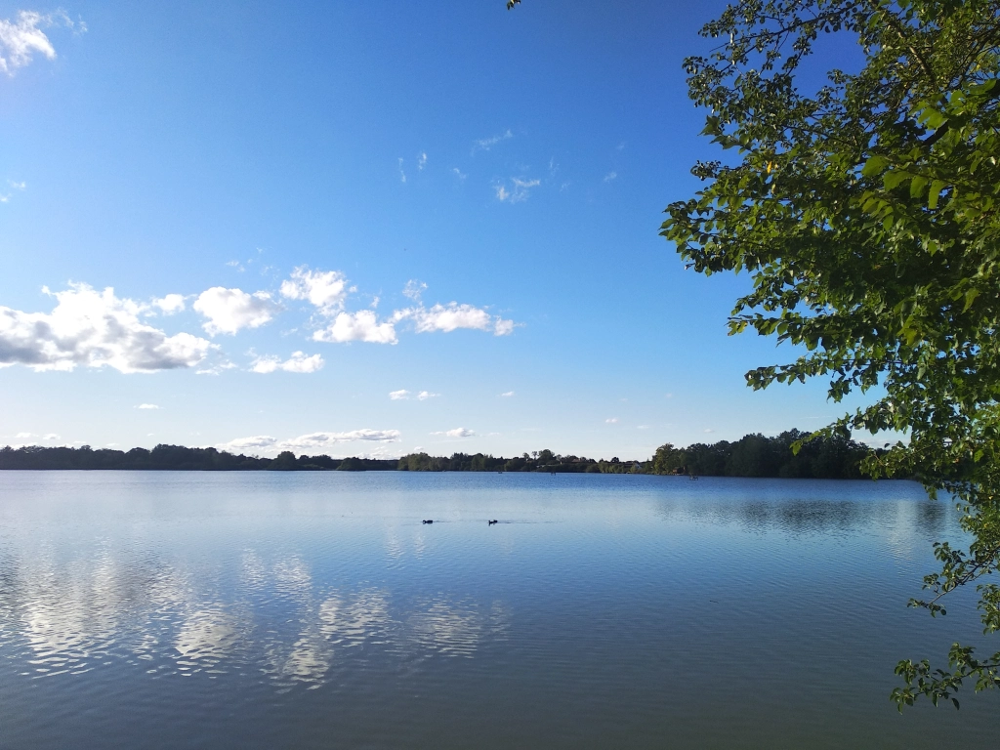
    <figcaption>One of our regular haunts seen in late summer.</figcaption>
</figure>

On October 11, I finally met up for the first time with Honza who came in his car and we birded together the whole day. I got 12 Czech lifers that day… And it was now clear to me what birding from a young age can do. An amazing experience, and some of the excitement I carried over into the next week, for the October Big Day on the 17th. I had no high hopes, but was determined to give it my best as it’d be my last (and first) October Big Day in Czechia. It was a gloomy and overcast day, with spells of showers in between. I surprised myself and came in at #4 in the country, seeing a total of 79 species in one day. I was amused because there were a few common ones that I was unable to clear off too! Honza of course came in at #1 with 101 species, but I consoled myself thinking I have the handicap of not having a car. The next day I fell sick, because I had been riding around on my bike in the cold and the rain from 0700 to 2100. 

<figure>
    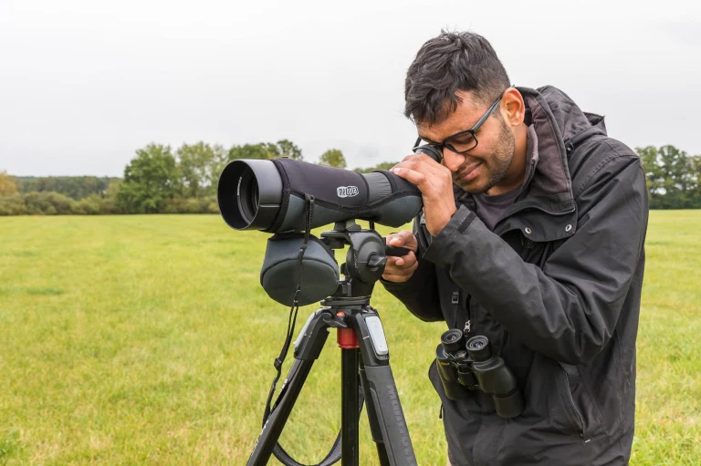
    <figcaption>My first time birding with a scope! Photo by Honza Grünwald.</figcaption>
</figure>

Again, nothing crazy after that except for some Redwings flying over at night. I woke up on 3rd December to white everywhere. It had snowed, and I was *definitely* going birding in the snow. It was an interesting experience. At first, the rooks and doves seemed to be larger than usual, and some of the rooks were even flying and gliding like raptors at times. Then, I felt that birds like pigeons and kestrels were brighter and fresher than usual, with the cream and rufous of the kestrel appearing very distinct and pleasing to the eyes. I realised later that this is due to the snow on the ground reflecting light upward, brightening the underside of wings when the birds are in flight; technically, one would say it is due to higher albedo!

I also witnessed my very first sparrowhawk hunt at point blank range! Towards the end of the observation, I was nearing a flock of ~40 rock pigeons feeding on the field near the road and was taking pictures of a few of them who had flown closer to me than the rest. I must have moved too close because the pigeons took off in flight. With that, I also lost my interest in them and was about to move along when out of nowhere a dark mass descended abruptly onto one of the pigeons and slammed it down onto the ground. I only then realised it was a sparrowhawk, and was amazed at having gotten such a point-blank view of the hunt (it happened ~20ft from me). I was even more surprised at how calm the sparrowhawk remained despite seeing me quite clearly so close to it---it gave me a few sexy stares. Then, guilt dawned on me, as I was the reason the pigeon got caught (pitying a pigeon?). All this in the span of a few seconds, 10 at most, while busy with the camera. Then, the sparrowhawk looked at me again then at the sky and gave a short call, and as suddenly as before another mass descended on the scene. This time, it was a kestrel (the same male I always spot in the area) attacking the sparrowhawk. The shortest of scuffles (a couple of seconds) ensued, during which the pigeon flew for its life. On seeing this, the kestrel went chasing the earlier flock of pigeons, while the poor sparrowhawk dejectedly returned to somewhere beyond the buildings.

<figure style="text-align:center">
    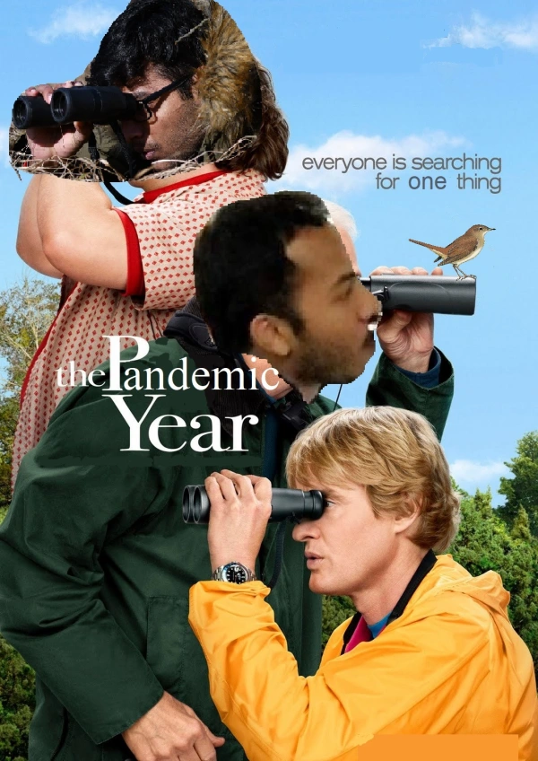
    <figcaption>Gotta get that nightingale!</figcaption>
</figure>

I ended the year with a lifer: I [twitched for a couple of Smew](https://ebird.org/checklist/S77873932) in one of the nearby ponds. They were very cute and I watched them for 1-2 hours, waiting for them to call but they never did. I was hoping for waxwings when I went up north to České Švýcarsko with Sailee, but although the trip didn’t provide any lifers, the numerous ravens at Raven’s Hill with their supreme calls booming throughout the valley was heavenly.

And so I finished 2020 having seen 170 species in the Czech Republic. I have also made it a habit to spend at least a few minutes everyday with birds (even balcony gazing counts), and my streak is currently at 300 days exact! Additionally, I succeeded in becoming the first non-Czech to enter the country’s top 10 for complete checklist submissions, something I am happy about. I have submitted 911 complete lists and my next immediate aim is to be the first non-Czech with 1000+ lists.

I also have a lot of species left to tick, which I am hoping won’t be hard as I have asked some Czech friends with cars for help. It’d be unforgivable if I were to leave Europe without seeing the Common Nightingale, a bird Sreekar and I spent all of spring seeking. The grouses, raptors, waxwing and many more are what I hope to see during the 6 months or so I have left here. 

## 2021

<figure>
    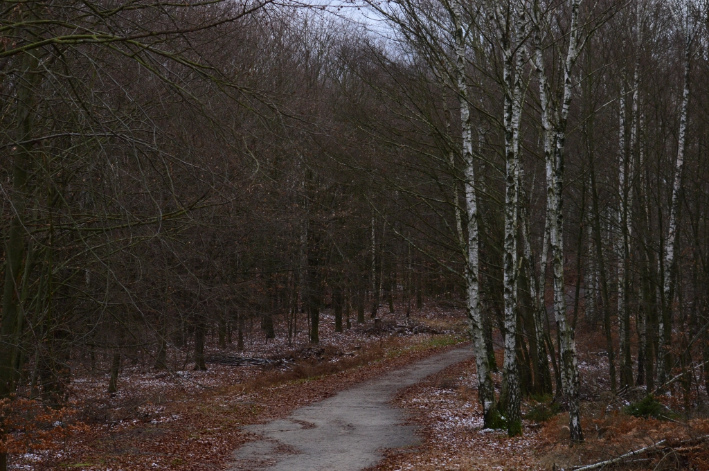
    <figcaption>Beautiful northern Bohemian forest in winter.</figcaption>
</figure>

I wish to switch up the style of the blog in 2021. First of all, I want to post more often. Content-wise, I want to write more of typical blog posts, whether I’m writing about a specific birding trip, or analysing a particular poem I love, or presenting some fun data or anything else. Hopefully, they won’t all be as long as this post. I definitely look forward to this year and hope I will be able to do more of what I truly love. To more growth and fortuities!