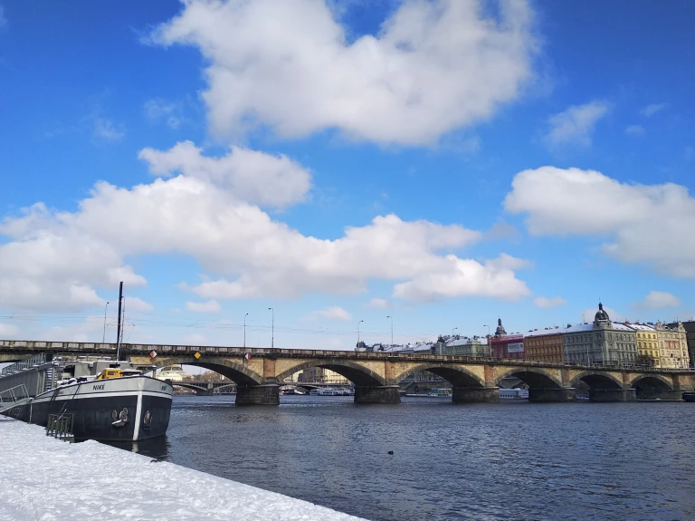
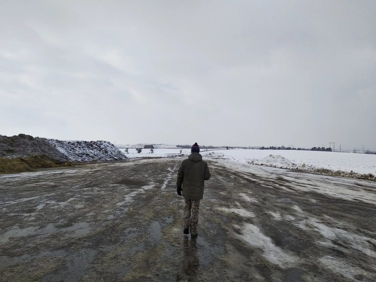
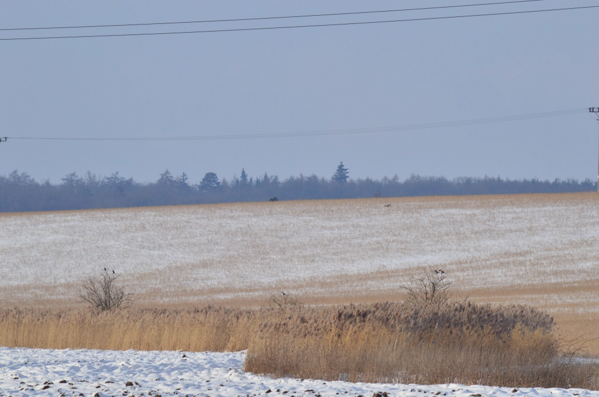
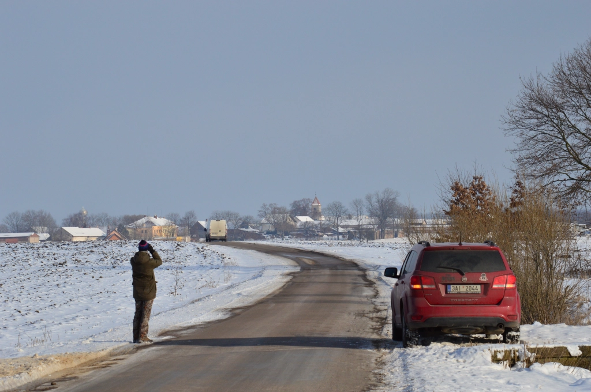
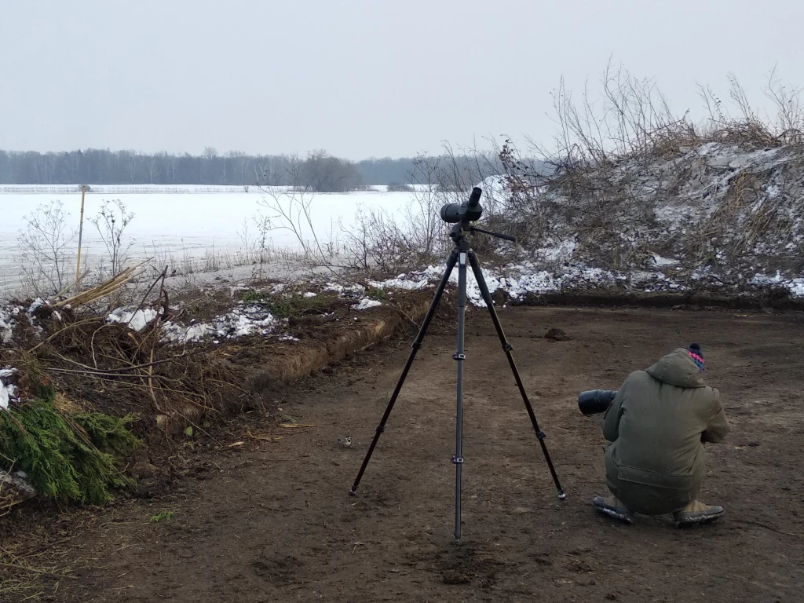
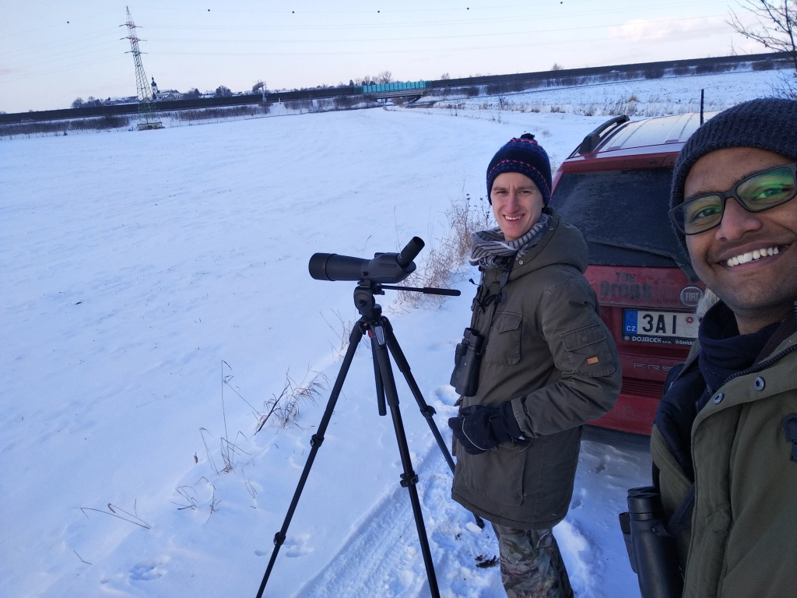
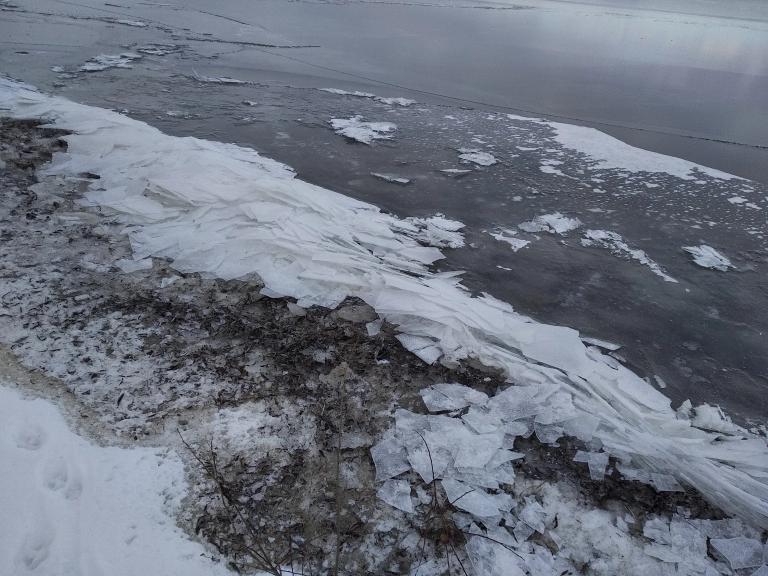
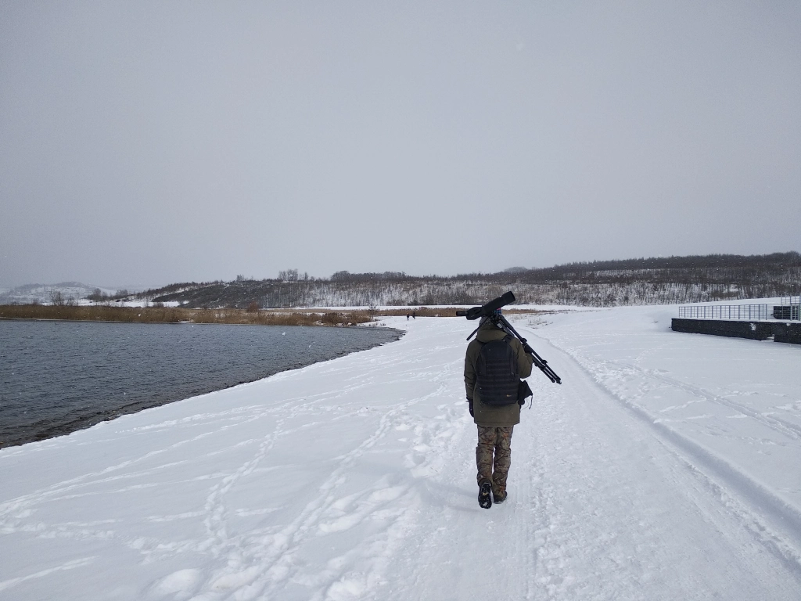
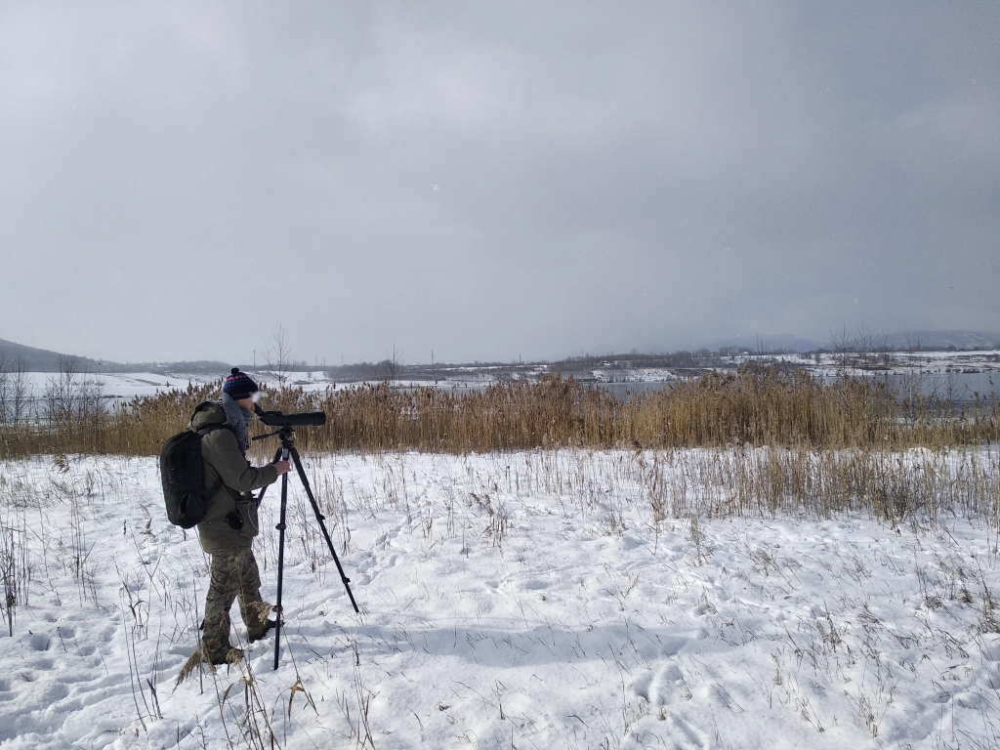
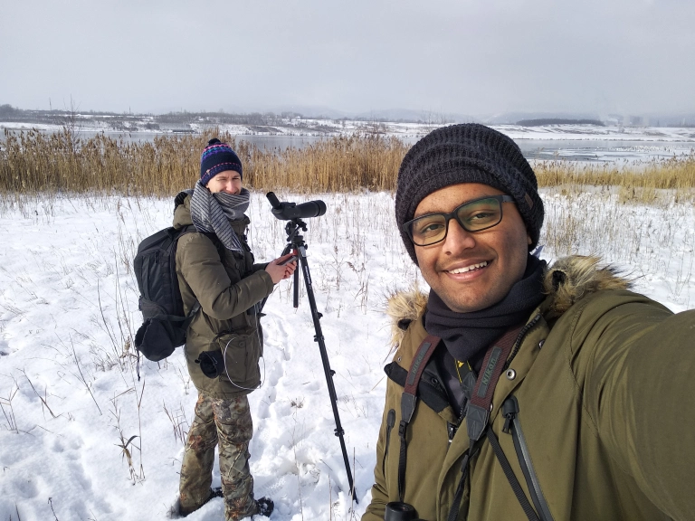

As I near the end of my stay in the Czech Republic, I have been feeling quite guilty about not having travelled enough and I’ve had enough of diligently waiting for the pandemic to pass. Luckily for me, this has been an unusually cold winter, so I won’t be missing out on *that* experience. And I still have a lot of birding to do here.

I asked Jan (Honza) Grünwald, who was technically my first Czech friend and whom I had found through eBird and contacted even before getting admitted to the university, if he’d be interested in birding together sometime, because I sure was! We had met (finally) in last October when we birded together on a lucky day, and it was a superb experience for me. There’s something different about being with someone who has vast knowledge of and experience with the country’s bird life. And so, I was eager to bird more with him. In fact, I wouldn’t even mind doing something every week, and I made sure to let him know the same. He turned out to be keen, and wanted to help me get my Czech life list to 200 (it was at 170).

We ended up deciding to do a two-day trip on 12--13 February, with Honza coming up with an insanely detailed plan of the locations we’d go to, with times, and the new species I’d possibly see. Not only was I impressed, but it also got me excited and slightly restless in the couple of days prior to the trip. That week had been very cold and dark with some snowfall as well, and temperatures were regularly dropping below the negative tens, but the 12th and 13th looked to be much nicer, at least according to the forecast. The days also coincided with the start of the [Great Backyard Bird Count](https://www.birdcount.org/), which was a nice bonus.

<figure>
    
    <figcaption>The Vltava river in Prague on 12 February 2021.</figcaption>
</figure>

## Friday, 12 February 2021

I got the earliest train I could, that left Budějovice at 0800 and reached Prague at 1030. I was apparently lucky to have reached on time without any major delay on the way, as snowfall like what we have been getting recently usually results in a descent into chaos. I spotted Honza’s red Fiat Freemont as soon as I took a few steps out of Prague’s main station, and we set off immediately to our first stop of the day, the Vltava riverside.

Although the sky wasn’t clouded up and there was sunshine, it was still fairly cold and required me to suit up with almost all my protection. (I had on thermal underwear under my pants, as well as under my T-shirt over which I had a fleece jacket and my high-utility parka. In addition, I had on a warm beanie and thin woollen gloves, with a second thicker and sportier pair of gloves in the reserve.) I got my first lifer of the trip immediately, the **Common or Mew Gull**. There was a decent number of these birds along with other gulls and waterbirds in the river. We walked around 2-3km along the river and saw a lot of nice birds, though nothing spectacular. Honza also meticulously took readings of the various rings he found on birds, and talked to me of how fascinating it can be to trace the past of a bird you see right in front of you. [It was a fun start to the day](https://ebird.org/checklist/S80973532), and we were now looking forward to the next stops outside Prague.

Next in the plan was a short stop near a chimney where we hoped to spot a Peregrine Falcon, but this was unfortunately not a success. However, we moved on with no heavy hearts because it is not at all a hard-to-find bird. By 1350, we got to Vyšehořovice, near a large dungpile situated in the middle of a vast expanse of fields. Such dungpiles are perfect for birds in winter due to the warmth they emanate. Strangely though, there was [hardly any activity](https://ebird.org/checklist/S80973540) when we got there. Honza still decided to walk around the dungpile a bit, when we spotted a small bird flying low above it and giving very faint flight calls. It did land a short distance away, still on the dungpile, but we could see only the upper half of its body from our position. Nevertheless, Honza knew from the first moment that it was the **Crested Lark** he often sees here and that he has nicknamed Pepa (short in Czech for Josef [pronounced yo-sef]). Other than that, there were only a group of raptors soaring way in the distance, so we decided to move on to the next location. Just as we started off from the area though, we caught sight of a group of Grey Partridges in the snow. On seeing us, they flew farther into the field where some individuals were barely able to poke their heads out of the snow. We stopped for a few quick photos and set off again.

<figure>
    
    <figcaption>Honza looking for Pepa near the dungpile in Vyšehořovice.</figcaption>
</figure>

Our next mission was to find a group of three Tundra Swans that had been observed in some of the fields near Dolany since the beginning of winter, but on the way we passed a large patch with long grass that stood out brilliantly against the white all around, where there seemed to be quite a few raptors. We spotted, in addition to Common Buzzards, a couple of **Rough-legged Buzzards** as well. The birds were quite distant but we got great views. The colours of the bird seemed to be in perfect sync with its habitat---the soft warm brown of the grass and the stunning white of the snow. This buzzard also has much sharper hands than its more common cousin does. We were enjoying the buzzard show when suddenly a female **Hen Harrier** decided to join [the party](https://ebird.org/checklist/S80973539) from behind the small hill. Although I would have preferred to see the silvery male, the female was no less beautiful and elegant. Raptors were my first love and I will never stop being in awe of them. Once the birds stepped into their intermezzo, we got going once more.

<figure>
    
    <figcaption>A Rough-legged Buzzard during its performance, with an audience of magpies.</figcaption>
    
    <figcaption>Honza and his Fiat Freemont.</figcaption>
</figure>

The search for the swans at the usual location failed. Well, we actually saw some Mute Swans there, but not the species we were looking for. We also sighted a pair of Common Cranes standing on the fields. Then, we stopped at another dungpile near Dolany, from where we saw three species of geese. There was also an extremely confiding White Wagtail at the dungpile which showed no fear as it moved within a metre of us. Or maybe it was cold and just desparate. [By now](https://ebird.org/checklist/S80973537), it was almost 4pm and it was starting to get cold(er). We searched a bit more in the fields for the Tundra Swans, but to no avail. However, we did see a few more partridges and a large flock of skylarks.

<figure>
    
    <figcaption>One of the rare occasions that 600mm becomes too long for birds. The fearless White Wagtail.</figcaption>
    
    <figcaption>Counting 182 skylarks on the snow-covered field.</figcaption>
</figure>

For our final stop of the day we went to Oplatil, which is a group of lakes, hoping for some rare waterbirds. This involved walking a fair distance in ankle-deep (or more) snow. The first lake we got to was frozen over, with two or three holes in the ice where the birds were concentrated. Soon after Honza started scanning with his scope, he exclaimed in amusement and asked me to see for myself. There they were, the three **Tundra Swans** we had been looking for the whole evening! Beautiful graceful birds that were unusually wintering in the area. We went further ahead to get better views and by now both of us had numb feet.

The second lake, also frozen, was where all the geese we’d been hearing in flight were resting, and Honza was able to spot, among the numerous Greylags and Greater White-fronteds, one **Tundra Bean-Goose**l. But when he asked me to look, I couldn’t find the bird so he had to recheck, but right then the geese decided to fly. Thankfully though, the individual had apparently landed nearby and Honza was able to spot it once again, and this time I got a quick look at it. We wondered what a shame it would have been if I had missed the sighting. The sun was beginning to set when another Czech birder arrived. The two Czechs were in conversation as we moved to a couple of other spots to look for more birds. [Finally](https://ebird.org/checklist/S80973534), we walked the cold way back to the car and Honza dropped off the man at the nearby train station.

It was now a bit too dark to find Short-eared Owls in the fields. We called it a day and headed to Honza’s home near Prague. I was given a warm welcome by his family and especially his two Great Swiss Mountain Dogs. They made a whole fuss barking at me but coyly and quite evidently wanted to be scratched and petted. I am generally not the biggest fan of soups, but Honza’s mother had made some from leek and chickpea which I absolutely loved! One could argue that it might have been because neither of us had eaten anything the whole day---I hadn’t touched the three lunchboxes and other snacks I had brought along with me---but I am inclined to think otherwise! Anyway, after a short but wonderful dinner, we went up to Honza’s room. He showed me his pets: a python, a pair of Zebra Finches and a fish. Moreover, his bedroom was the attic right above, to which led a cool little staircase. He also had a huge collection of bird-related books among others. Overall, I loved the setup. He then showed me the process of submitting the bird ring readings he had taken, after which we discussed in detail which species it is actually feasible to be planning future trips for. Once we had come up with a rough idea, it was time for bed as we were going to wake up early tomorrow.

## Saturday, 13 February 2021

We were awake by 0515 so as to have enough time for a quick breakfast; we didn’t want to fast again. While the previous day had us visiting locations relatively close to Prague, in the eastern parts of Central Bohemia, our destination today was the region of northwestern Bohemia, Ústecký kraj. We were aiming for 2-3 huge reservoirs which have recently been great for birds. They were about 140km away, which is why we got going before 0600.

We arrived by 0730 at the first reservoir, Nechranice---a gigantic water body spanning 1338ha (~13sq.km) and the fifth largest reservoir in the country. We first wanted to get an overview of the whole dam and see where the birds are, so we climbed up to a nice vantage point on the wall, and it was painfully cold. Honza was shocked at seeing this huge body of water frozen over, which was a testament to how cold this winter actually has been. Poor birds. We did spot some patches of unfrozen water where birds were concentrated, and boy were there a lot of them! We could make out literally thousands of gulls in the distance, and fewer numbers of other ducks and geese as well. Now that we got an idea of where the birds were, we had to get closer to them.

This proved annoyingly difficult, as the land around the reservoir is mostly privately owned, including a campsite closed off for the winter at the perfect spot for us. We tried a few different options but kept having to turn the car back, until we finally found one that worked. However, we had unknowingly ended up much farther away from the vantage point we had spotted on the map, and hence couldn’t get a good look at the gulls and geese. At the same time, the gulls decided to start off their day and fly off to their foraging grounds en masse. Although this was a spectacle in itself, this meant that we missed the chance of spotting some rare gulls in the gigantic flock. 

Luck was still with us though, as Honza soon exclaimed again from his scope. I hurriedly looked through and saw five Velvet Scoters making a long flight over the water. Or at least, I believed Honza’s declaration that they were indeed **Velvet Scoters**. They were so far away that we could see just the fully black body with white on the wings that flashed with the motion of their wingbeats, but it was still possible to rule out the other similar species and moreover, people had been spotting it here of late. I was quite happy with the sighting as it is quite a rare species, and I managed to watch it even if for just a minute. It would have been a shame if yesterday’s Tundra Bean-Goose incident had repeated itself.

<figure>
    
    <figcaption>Stunning thin ice sheets on the banks of Nechranice reservoir.</figcaption>
</figure>

The scoters didn’t land anywhere as far as we could see and we couldn’t observe much else from where we were, so we wanted to switch locations. We decided to park near a forest trail near the campsite and walk the ~1km to the edge of the water. This walk was an experience in itself, as we were shuffling through up to 20cm of soft fine snow. Despite that wonder, we were uncertain if our effort and time would go to waste, but this was soon enough answered by yet another signature exclamation-from-scope: there were two beautiful **Barnacle Geese** resting in the crowd of Greylags and ducks. They weren’t too obscurely positioned, and we managed to walk a bit further to get even better views. Although the geese were alerted to our presence, they didn’t fly off and we tried to be as non-threatening as possible. This was only Honza’s fourth-ever sighting of the species in Czechia, and the first time he simply came upon the species (rather than twitching for it). Being unfamiliar with the country’s bird life, I only know most of the rare species from eBird records, and this in a weird way normalises all the sightings---it is not easy to appreciate a rare sighting to the full extent. So, Honza made sure to stress on the significance of our sighting. The birds themselves were pretty and had yellow-tinged cheeks. We watched them for a long time, and also noticed strange and surreal sounds coming from the frozen dam. These sounds were enthralling and I could listen to them all day. (Learn more about this phenomenon in [this wonderful video](https://www.youtube.com/watch?v=chxn2szgEAg&t=0s) by Jonna Jinton.) [In the end](https://ebird.org/checklist/S81052455), the two Barnacles and some Greylags took off away from the reservoir, and we swiftly followed suit. We still had another huge reservoir to explore.

We had half an hour to the next place, and we had “lunch” in the car. Shortly before the destination though, we saw tremendous flocks of geese in the sky that eventually landed somewhere nearby. We decided to take a short detour and found the geese on some rolling fields, due to which all of them were initially not visible, but as we moved to a better spot we saw hundreds and hundreds. Perhaps the most populous species in the flock was the Tundra Bean-Goose, which was funny because of the previous day’s incident. There were also some Greater White-fronteds and Greylags. We didn’t want to lose too much time here though, so we moved on after getting [decent views](https://ebird.org/checklist/S81053830).

We finally reached Most Reservoir by 1140, and immediately saw sheer multitudes of waterbirds. This reservoir was not as frozen over as Nechranice. Just as we stepped up to the edge of the reservoir, the weather went crazy. It was already very cold and now it began snowing heavily, the snowflakes big and fluffy. This was not just challenging but also irritating, as the flakes would melt on landing on our lenses (of the binoculars and scope). We got busy.

Honza immediately showed me some **Herring Gulls**, and a **Water Pipit** conspicuously flew in and landed right next to us. He ended up spotting a **Great Black-backed Gull** within 10 minutes. The latter was the prime twitch of this location, and was a lifer for me and a Czecher for Honza. It was a beautiful adult bird (with the beautiful dark grey wings) that was standing amidst Caspians and other large gulls, so we could see how much bigger it was than them. It had been spotted multiple times in the previous weeks and so seemed to be a long-staying bird. It was just preening and resting on the ice at first, but later got up and moved around a bit. I even witnessed it fall accidentally into the cold cold water as the ice it had stepped on broke off, then hurriedly and almost sheepishly clamber back up. This gave me a good laugh. 

<figure>
    
    <figcaption>Starting our ~9km walk around Most Reservoir.</figcaption>
    
    <figcaption>Honza busy reading rings on gulls.</figcaption>
</figure>

The weather changed swiftly and the sun even came out. We started our ~9km walk around the whole reservoir. I was finding it hard to comprehend the sheer numbers of birds that were in the water. It all seemed so surreal and I don’t think I have fully processed it still. The walk itself was great and there were some cross-country skiiers as well. We stopped at various points to scan the new groups of birds. And Honza made sure to read the bird rings, of course. I was mostly trying to take it all in. The gulls were majorly Caspian, and kept making all sorts of hilarious calls, like what I perceived as sassy *aows* (as in “aow yeah!”) and carefree and liberating rows of gawky laughter. (Seriously, check out the audio, it’s worth it.) <iframe width="320" height="380" src="https://macaulaylibrary.org/asset/307589181/embed/320" frameborder="0" allowfullscreen style="width:320px;text-align:center"></iframe>

The path around the reservoir is on hilly terrain, so for a large part of the walk we had a semi-bird’s-eye view of the birds in the water. This meant that the thousands of gulls appeared to us as masses of dots on the gloomy water surface. We ended up seeing multiple **Greater Scaups**, a couple of Water Rails, more Water Pipits, and many more. But we were unable to spot **Arctic Loons** which had been seen here even yesterday, until the very end when Honza decided to make one final attempt and found a single bird. Sometimes, that’s just how it is.

Overall, we must have seen at least 15,000 birds of which more than half were just gulls. A remarkable place and a remarkable experience. We departed after [four and a half hours in Most](https://ebird.org/checklist/S81099998), to search for two regular Whooper Swans. The twitch was unsuccessful though, and after finishing the rest of our lunch, we headed back to Prague from where I had my train back at 1830. Needless to say, we were both (gladly) exhausted from the walking and the cold. Honza’s prophecy came true as my train was delayed by an hour. I ended the night with a long warm shower, my mind occupied with trying to process the day’s events and excited for the next trip. I was able to witness how fun birding can be in even the harshest of conditions.

<figure>
    
    <figcaption>Birds, birds and more birds in Most Reservoir.</figcaption>
</figure>

## List of lifers, 12--13 February 2021

589. Mew Gull
1. Crested Lark
1. Rough-legged Hawk
1. Hen Harrier
1. Tundra Swan
1. Tundra Bean-Goose
1. Velvet Scoter
1. Barnacle Goose
1. Herring Gull
1. Water Pipit
1. Great Black-backed Gull
1. Greater Scaup
1. Arctic Loon
