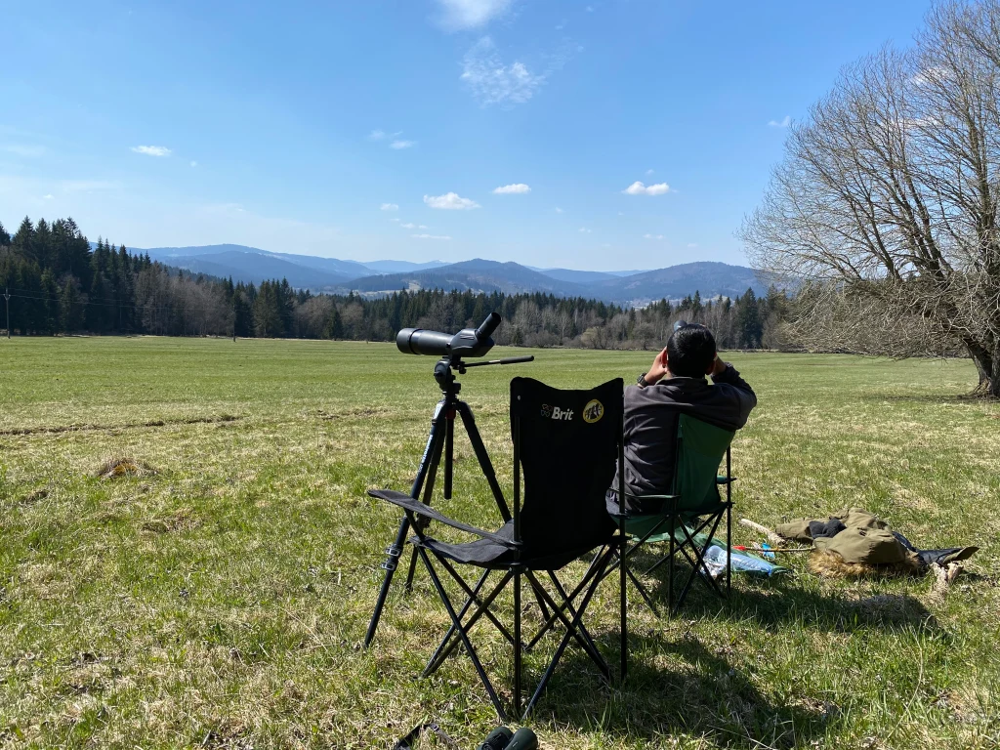
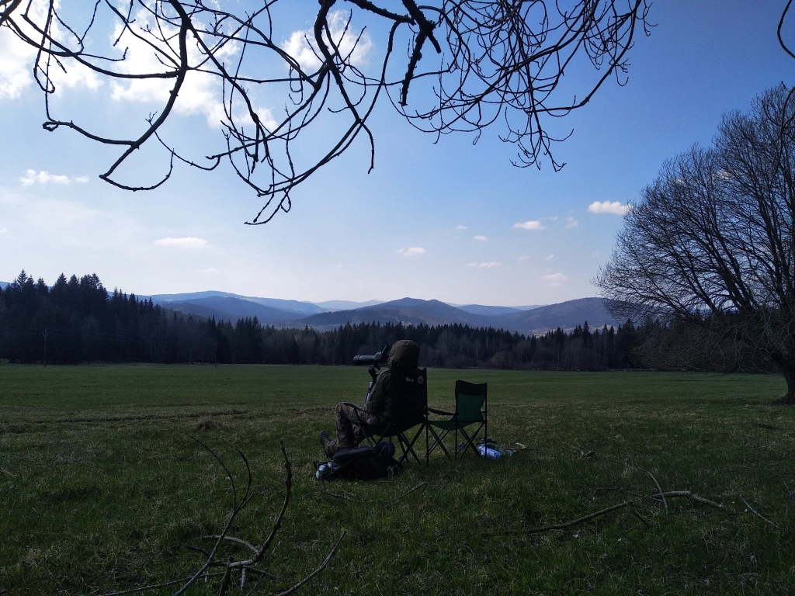
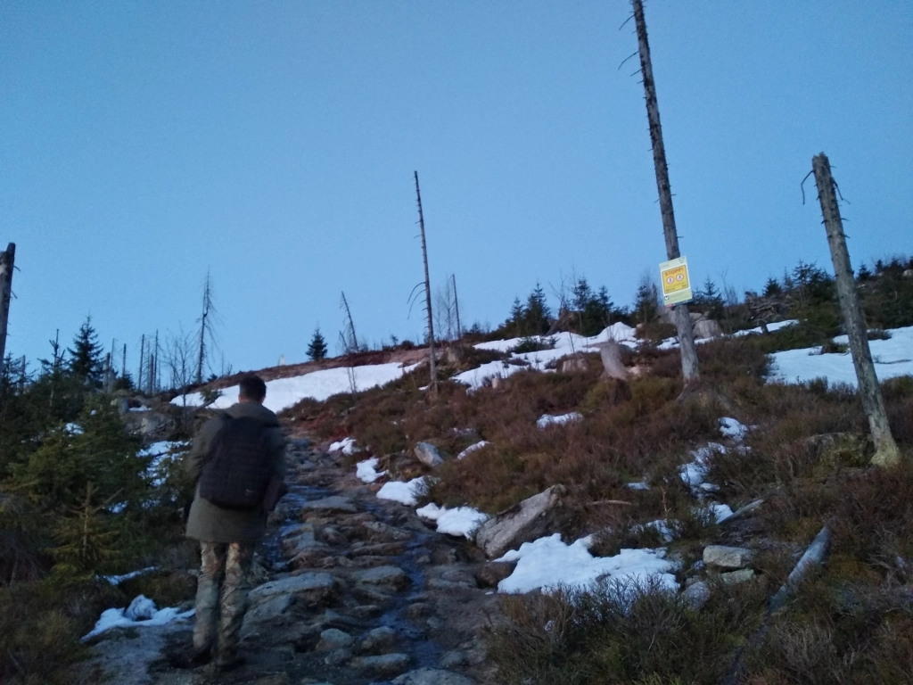
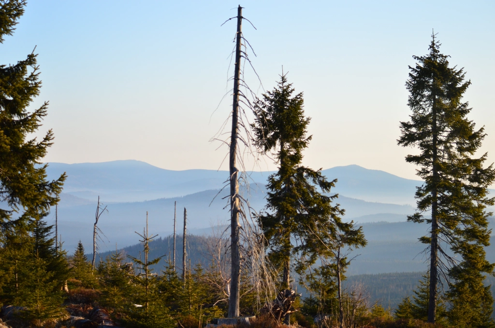
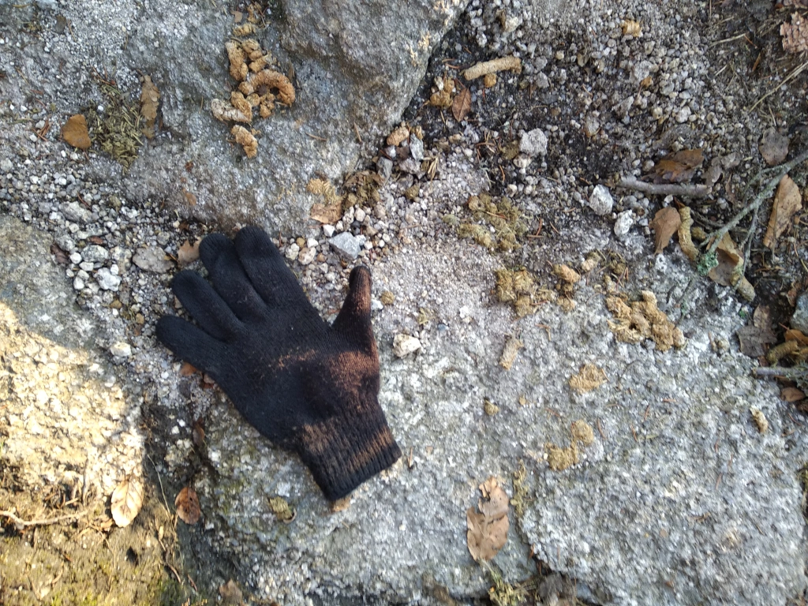
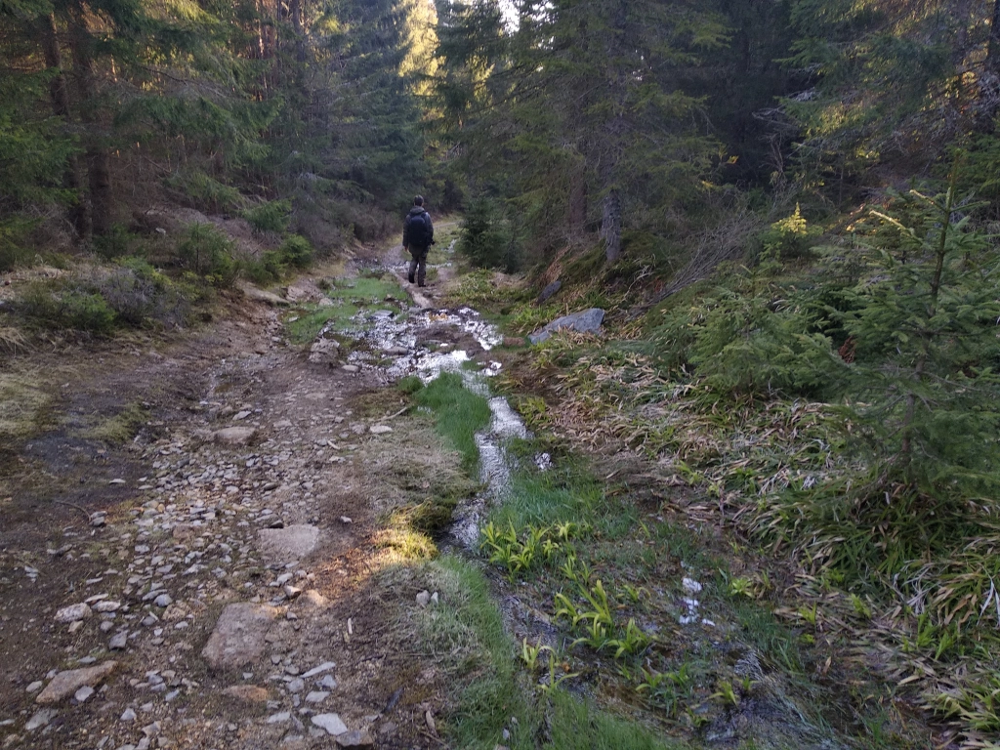
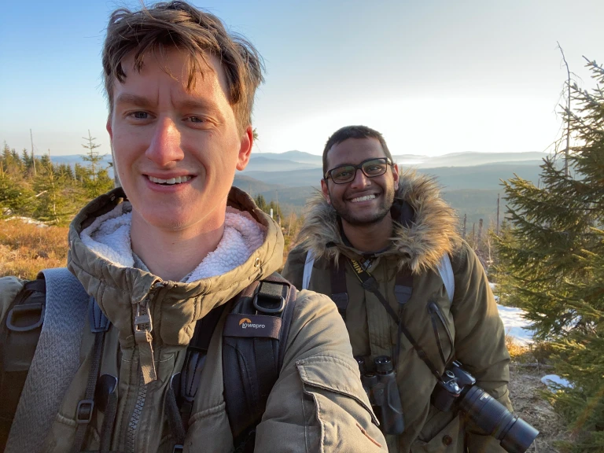

```{r setup, include=FALSE}
knitr::opts_chunk$set(echo = FALSE, warnings = FALSE, messages = FALSE)
```

A spring birding trip to Šumava had been set in stone long back, but the question was when exactly. In early March, I dove head first into my thesis work, for its submission in mid-April. Despite having a crude calendar on which I crossed off each day as I passed it, that whole month and a half honestly flew past, and all I can remember is my laptop. As I got deeper into my work, I only realised that it would take even longer, and I was worried and frustrated that I would miss much of the springtime bird wonder. Luckily for me though, this spring has been a complete mess, with cold waves through March and snowfall even in April. This shifted all phenologies quite a bit, and I could see that I didn’t miss too much.

Skipping past the gritty details of the thesis phase (perhaps for another time), I submitted on 13th April. This would usually have been a good time for grouses and owls in Šumava, but this year there was still 2-3 cm of snow cover, and the boss Honza Grünwald suggested we wait a bit. So, I focused on getting as much of my other work done as possible, and tried to free up my schedule as much as I could so that I’d be totally free to go all-out birding in May and June. And that is when, a few days later, Honza messaged me randomly one morning asking of my plans for the very next day. I had no rigid appointments, and we decided to go on a three-day birding trip---right after Honza twitched for a Slender-billed Gull (mega-rarity) reported some 200 km away on the other side of the country. This, unfortunately, was a failure as the bird left a couple of hours before he arrived. Despite this, and despite barely getting decent sleep, he managed to get to České Budějovice the next afternoon and in a jovial and hopeful mood.

<figure>
    
    <figcaption>The rising sun as seen from the top of Třístoličník mountain in Šumava on 28 April 2021, as we waited for capercaillies.</figcaption>
</figure>

## Monday, 26 April 2021

This trip was going to be unlike our previous ones, more raw and hardcore, so I took with me a rucksack with enough food and water, and other essentials including a 10 degree sleeping bag I had bought in India. We met and [kicked off the birding](https://ebird.org/checklist/S86419285) at the Vrbenské ponds, possibly the best hotspot in town. And as luck would have it, we started off with a bang---we stumbled upon a seemingly 4CY Great Black-backed Gull! Among the 12 lifers I had gotten in our [winter trip in February](https://kartrick.rbind.io/blog/09_czech-birding/01_winter-bohemia/), this was the one I had considered least likely to see again. After the initial elation and processing of the sighting, I started wondering how many such birds I’d be missing on a regular basis simply because I don’t have a scope. We ended up staying there for quite some time, and Inga even came twitching for it (though she didn’t end up ticking it for herself as she was not satisfied with the bird identification).

After even some more time, we realised it was getting late and headed off to Dehtář pond where we had plans of spending the night (‘camping’ beside the pond). On the way, we spotted a nice large transient puddle on a meadow, where there were some waders, including a Black-winged Stilt---one of the early arrivers and a Czecher for me. We then arrived at Dehtář and started a [relaxed birding session](https://ebird.org/checklist/S86433789), involving some foldable lawn chairs, snacks/dinner and beer. Here we got no particularly special bird, but did get some FoYs including Black Terns. As the sun was setting and the darkness creeped in, I spotted a fox hunting between us and the pond---my first-ever fox! I did take a video of it but had my settings all wrong, so although it looked great in the camera screen while recording, the actual file is just darkness and the grey of the water. Later, we also saw an owl flying in a similar trajectory and direction, but it was too dark to confirm that it was a Short-eared Owl (which would have been a lifer for me). 

<figure>
    
    <figcaption>Relaxed birding at Dehtář pond with snacks and beer.</figcaption>
</figure> 

<figure>
    
    <figcaption>The relaxed birding setup and a beautiful sunset at Dehtář pond. Photo: Honza Grünwald.</figcaption>
</figure>

We soon retired for the night, with me sleeping outside just beside the car (which sheltered me from the worst of the wind). I was well aware of the weaknesses of my dear sleeping bag, so I had come prepared. I had on a thermal shirt, a T-shirt, a fleece jacket and a winter parka over my torso; a simple semi-winter pair of pants; very thin socks; simple wool gloves; and a woollen beanie and over it the parka hood. In this form, I went to sleep. The first two hours or so passed fine until I woke up, and then I kept waking up pretty much every hour. The cold could have been worse, but it was still uncomfortable and by 05:00 I just couldn’t go back to sleep and had had enough. So, I got up around 20 minutes before the promised time and tried to walk around to warm myself up.

## Tuesday, 27 April 2021 

It had gone down to at least -2$^\circ$C though, and my sleeping bag and boots and glasses had all frosted up. And inserting my numb feet into the super-cooled boots did nothing to warm them up in spite of my walking. Eventually, Honza also got up, having refreshed himself with fairly decent sleep. We birded there once more, but since we didn’t see anything new and interesting, we decided to head off to the next spot. We were supposed to find lekking Black Grouse, but an unfortunate low battery warning in Honza’s car key forced us to take a detour of about an hour. This ended up being critical, as we were unable to spot any Black Grouses even though we tried two good spots. We arrived at the first at 08:30, which is actually not *too* late, but that’s just how it goes sometimes.

We then headed to the Volary area and started off on a 10 km walk. The closest thing to a rule in Šumava is that to see something spectacular requires a lot of walking. It’s a one-way relationship though, as we walked the 10 km in 2h45m and the highlight was a *Daphne mezereum* in flower (commonly known as February Daphne, it spoke to the madness of this spring). It was now 13:00 and we got some lunch from a nearby Chinese restaurant, then went to a particularly nice meadow near Stožec that sat elevated, overlooking some forests and more hills to the south. 

```{r out.width="49%", echo=FALSE}
knitr::include_graphics("frost-bag.jpg")
```

```{r out.width="49%", echo=FALSE}
knitr::include_graphics("frost-boots.jpg")
```

```{r out.width="49%", echo=FALSE}
knitr::include_graphics("bark-beetles.jpg")
```

```{r out.width="49%", echo=FALSE}
knitr::include_graphics("noodles.webp")
```

Here, the lawn chairs came out once again and we ate lunch whilst keeping an eye (or four) out for migrating birds. We attended a seminar from Charles University in between. The direct sun was very welcome, and the shade and wind a cold dread. However, I had not taken my sunglasses with me and the sun was a bit of a bother on more than one occasion. We also noticed something funny about the sun: at about [14:00 when we started](https://ebird.org/checklist/S86628261), the sun was strangely leaning quite a bit towards the east, and in the 3 hours that we sat there, it seemed to race along the sky to a more appropriate westerly position. The migration watch was overall a great experience. I had never tried something like this before. Highlights were a White-tailed Eagle (not much water nearby) and a migrating Eurasian Hobby (FoY). 

```{r out.width="49%", echo=FALSE}

```

```{r out.width="49%", echo=FALSE}

```

We then got to Stožec and headed off on a valiant effort for some owls and grouses. We [started at 17:30](https://ebird.org/checklist/S86512350) and walked another 10 km in about 4 hours, [ending by 21:30](https://ebird.org/checklist/S86512127) to be well-rested the next morning. A short playback for the Hazel Grouse did the trick, and we heard a bird respond (lifer #1), [calling 5–7 times](https://macaulaylibrary.org/asset/335864471). Although we hid low behind a bank and the bird must not have been more than 20 m away, we could not see it. Nevertheless, we were very happy and it revived our spirits. We didn’t have as much luck with owls though. Three main targets were the Eurasian Pygmy-Owl, Boreal Owl and Ural Owl. Honza tried his best to attract the former with his whistling and we checked spots where he had seen them in the past, but to no avail. We did, however, get at least 5 Eurasian Woodcocks (lifer #2) that roded overhead giving their strange calls, and at least 3 Common Snipes that were winnowing with the amazing sounds produced by their tail feathers.

So all in all, quite a satisfactory session, signed off by a full moon with a rich crimson aura hanging low on the horizon as we walked back to the car. This time, we would get only 4.5 hours of sleep and Honza decided that both of us could just sleep in the car, on reclined seats. I removed my parka to prevent it from getting too filthy, and used my sleeping bag as a blanket. It still got very cold, about -4°C, by the early hours of the morning and I woke up 2–3 times again. We got up at 02:30, brushed and drank some water quickly, and set off for the arduous hike up Třístoličník mountain for the Western Capercaillie.

## Wednesday, 28 April 2021 

I carried just my water bottle and an apple. We [started at 03:00](https://ebird.org/checklist/S86542833) and immediately heard a Boreal Owl (lifer #3) calling way off in the distance. We got more individuals later, as well as a couple of woodcocks. Most of our focus, however, was on the walk. We made extremely good progress in the first section of the route (on tarmac and with constant but slight altitude gain), covering around 7–8 km in 2 hours. Then came the second section of 2–3 km, which was a regular trail up to one of the peaks of the mountain, and a very steep climb. We were still lucky though, as most of the snow and ice had melted away (Honza had had it worse in the past). Towards the end, we were taking maybe 10 steps every minute. 

```{r out.width="49%", echo=FALSE}

```

```{r out.width="49%", echo=FALSE}

```

The horizon hinted of the sun at us in a fine pink strip kissing the horizon. Once, something huge flew off from near us. Light was arriving and treecreepers, robins, thrushes and tits were alive with chatter, seemingly edging us onward. We finally made it to the spot, and I went for my water and apple. Honza immediately pointed to the call of a Ring Ouzel (lifer #4) coming from the base of some short spruces. It was a great addition, but our eyes and ears were on the prize. The pink in the east was diffusing and the incredible scenery all around was taking on colour. As we sat there, we heard something large fly near us once again.

The sun had now officially risen, and finally, Honza pointed to a brown spot on one of the leafless spruces which I had seen but not yet checked as I was busy with my apple (I was starving). It was a female Western Capercaillie (lifer #5). The apple could wait. We watched it for a few seconds and took some pictures, then heard a strange grunting sound coming from the bird. Soon, the sound came from 2–3 other spots as well, suggesting more female capercaillies than we could see. The first bird took off in a slow flight, still calling, and crossed the small valley to another leafless spruce on the other side. We inspected the other hills and eventually spotted a male bird also on a spruce. It was quite far away and we could not hear any displaying males (which produce one of the weirdest bird sounds), but that would have been asking for too much. 

<iframe src="https://macaulaylibrary.org/asset/398405711/embed" height="515" width="640" frameborder="0" allowfullscreen></iframe>

We were overjoyed with the 5 or so individuals we saw and/or heard. The 10 km walk had left our minds. We stayed for around 15 minutes more, [enjoying the capercaillies](https://ebird.org/checklist/S86546401) and the view of three countries (CZ, DE, AT), and then decided to make our way down. The capercaillies weren’t done with us, though. We heard one more female calling from some bushes and, just as we were about to take a selfie to commemorate the sighting and to record our happy faces, a male bird came from another hill and flew right over our heads! It was a beautiful sight; I didn’t even reach for my camera or binoculars and instead just gazed open-mouthed, while Honza got great shots although he was a bit late to react. We had been rewarded graciously. 

<iframe src="https://macaulaylibrary.org/asset/398405881/embed" height="515" width="640" frameborder="0" allowfullscreen></iframe>

```{r out.width="49%", echo=FALSE}

```

```{r out.width="49%", echo=FALSE}

```

On the walk back, we were all smiles and took it slow. We even got a fleeting glimpse of a Eurasian Nutcracker (lifer #6) in flight. We stopped to enjoy a slim Vltava that had carved its way beautifully. I refilled my empty water bottle and recharged myself with the sweet water. We talked birds, Big Days and life. We made it to the car by 09:15, and took some time to organise our stuff. It was now warm enough to wear just a T-shirt, and so I did. We had some breakfast and soon departed. We were both by now visibly exhausted. We stopped at a small pond on the way for a short while, then Honza dropped me off at the university.

And thus we ended our fantastic multi-day trip, still processing it and yet looking forward to the next. I didn’t do much after getting to my room, and at 18:00 I passed out for 14 hours. The trip was immensely fun, trying, spontaneous, and a great success. As usual, I was mesmerised and completely taken in by the truly infectious passion for birds. This was another one for the history books.

```{r out.width="99%", echo=FALSE}

```

## List of lifers, 26--28 April 2021

605. Hazel Grouse
1. Eurasian Woodcock
1. Boreal Owl
1. Ring Ouzel
1. Western Capercaillie
1. Eurasian Nutcracker