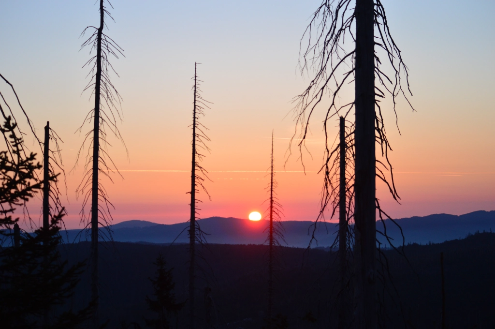
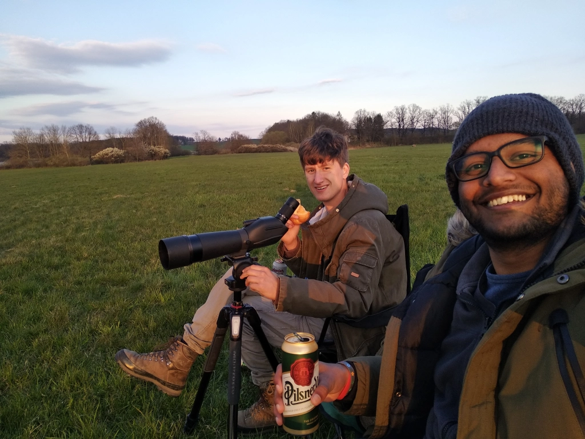
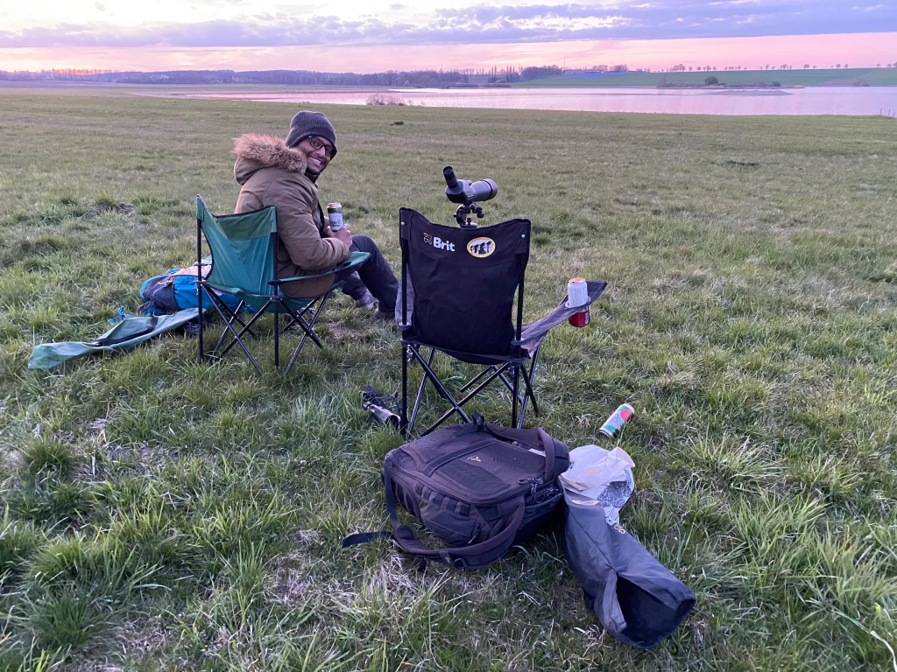
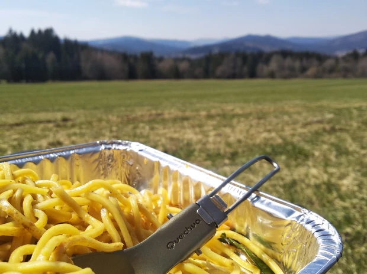

A spring birding trip to Šumava had been set in stone long back, but the question was when exactly. In early March, I dove head first into my thesis work, for its submission in mid-April. Despite having a crude calendar on which I crossed off each day as I passed it, that whole month and a half honestly flew past, and all I can remember is my laptop. As I got deeper into my work, I only realised that it would take even longer, and I was worried and frustrated that I would miss much of the springtime bird wonder. Luckily for me though, this spring has been a complete mess, with cold waves through March and snowfall even in April. This shifted all phenologies quite a bit, and I could see that I didn’t miss too much.

Skipping past the gritty details of the thesis phase (perhaps for another time), I submitted on 13th April. This would usually have been a good time for grouses and owls in Šumava, but this year there was still 2-3 cm of snow cover, and the boss Honza Grünwald suggested we wait a bit. So, I focused on getting as much of my other work done as possible, and tried to free up my schedule as much as I could so that I’d be totally free to go all-out birding in May and June. And that is when, a few days later, Honza messaged me randomly one morning asking of my plans for the very next day. I had no rigid appointments, and we decided to go on a three-day birding trip---right after Honza twitched for a Slender-billed Gull (mega-rarity) reported some 200 km away on the other side of the country. This, unfortunately, was a failure as the bird left a couple of hours before he arrived. Despite this, and despite barely getting decent sleep, he managed to get to České Budějovice the next afternoon and in a jovial and hopeful mood. 

<figure>
    
    <figcaption>The rising sun as seen from the top of Třístoličník mountain in Šumava on 28 April 2021, as we waited for capercaillies.</figcaption>
</figure>

## Monday, 26 April 2021

This trip was going to be unlike our previous ones, more raw and hardcore, so I took with me a rucksack with enough food and water, and other essentials including a 10 degree sleeping bag I had bought in India. We met and [kicked off the birding](https://ebird.org/checklist/S86419285) at the Vrbenské ponds, possibly the best hotspot in town. And as luck would have it, we started off with a bang---we stumbled upon a seemingly 4CY Great Black-backed Gull! Among the 12 lifers I had gotten in our [winter trip in February](https://kartrick.rbind.io/blog/09_czech-birding/01_winter-bohemia/), this was the one I had considered least likely to see again. After the initial elation and processing of the sighting, I started wondering how many such birds I’d be missing on a regular basis simply because I don’t have a scope. We ended up staying there for quite some time, and Inga even came twitching for it (though she didn’t end up ticking it for herself as she was not satisfied with the bird identification).

After even some more time, we realised it was getting late and headed off to Dehtář pond where we had plans of spending the night (‘camping’ beside the pond). On the way, we spotted a nice large transient puddle on a meadow, where there were some waders, including a Black-winged Stilt---one of the early arrivers and a Czecher for me. We then arrived at Dehtář and started a [relaxed birding session](https://ebird.org/checklist/S86433789), involving some foldable lawn chairs, snacks/dinner and beer. Here we got no particularly special bird, but did get some FoYs including Black Terns. As the sun was setting and the darkness creeped in, I spotted a fox hunting between us and the pond---my first-ever fox! I did take a video of it but had my settings all wrong, so although it looked great in the camera screen while recording, the actual file is just darkness and the grey of the water. Later, we also saw an owl flying in a similar trajectory and direction, but it was too dark to confirm that it was a Short-eared Owl (which would have been a lifer for me). 

<figure>
    
    <figcaption>Relaxed birding at Dehtář pond with snacks and beer.</figcaption>
</figure> 

<figure>
    
    <figcaption>The relaxed birding setup and a beautiful sunset at Dehtář pond. Photo: Honza Grünwald.</figcaption>
</figure>

We soon retired for the night, with me sleeping outside just beside the car (which sheltered me from the worst of the wind). I was well aware of the weaknesses of my dear sleeping bag, so I had come prepared. I had on a thermal shirt, a T-shirt, a fleece jacket and a winter parka over my torso; a simple semi-winter pair of pants; very thin socks; simple wool gloves; and a woollen beanie and over it the parka hood. In this form, I went to sleep. The first two hours or so passed fine until I woke up, and then I kept waking up pretty much every hour. The cold could have been worse, but it was still uncomfortable and by 05:00 I just couldn’t go back to sleep and had had enough. So, I got up around 20 minutes before the promised time and tried to walk around to warm myself up.

## Tuesday, 27 April 2021 

It had gone down to at least -2$^\circ$C though, and my sleeping bag and boots and glasses had all frosted up. And inserting my numb feet into the super-cooled boots did nothing to warm them up in spite of my walking. Eventually, Honza also got up, having refreshed himself with fairly decent sleep. We birded there once more, but since we didn’t see anything new and interesting, we decided to head off to the next spot. We were supposed to find lekking Black Grouse, but an unfortunate low battery warning in Honza’s car key forced us to take a detour of about an hour. This ended up being critcial, as we were unable to spot any Black Grouses even though we tried two good spots. We arrived at the first at 08:30, which is actually not *too* late, but that’s just how it goes sometimes.

We then headed to the Volary area and started off on a 10 km walk. The closest thing to a rule in Šumava is that to see something spectacular requires a lot of walking. It’s a one-way relationship though, as we walked the 10 km in 2h45m and the highlight was a *Daphne mezereum* in flower (commonly known as February Daphne, it spoke to the madness of this spring). It was now 13:00 and we got some lunch from a nearby Chinese restaurant, then went to a particularly nice meadow near Stožec that sat elevated, overlooking some forests and more hills to the south. 

```{r out.width="50%"}
knitr::include_graphics("frost-bag.jpg")
```
```{r out.width="50%"}
knitr::include_graphics("frost-boots.jpg")
```

```{r out.width="50%"}
knitr::include_graphics("bark-beetles.webp")
```
```{r out.width="50%"}

```

