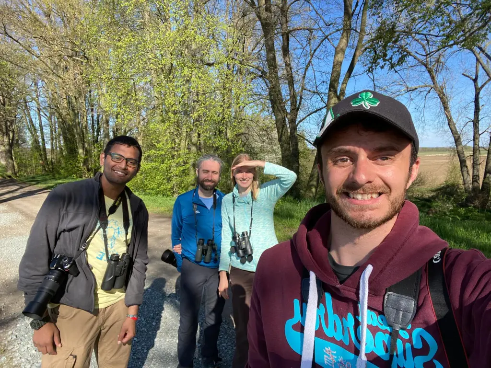
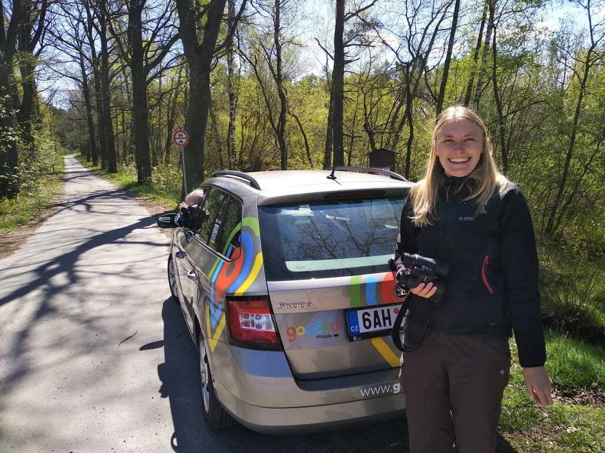
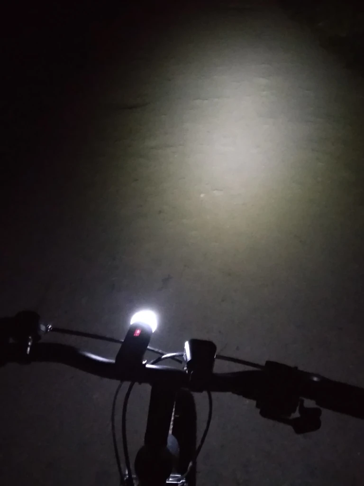
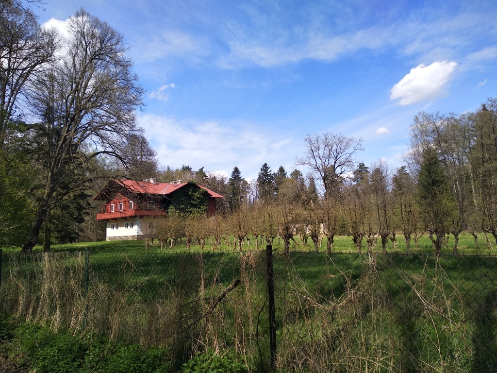
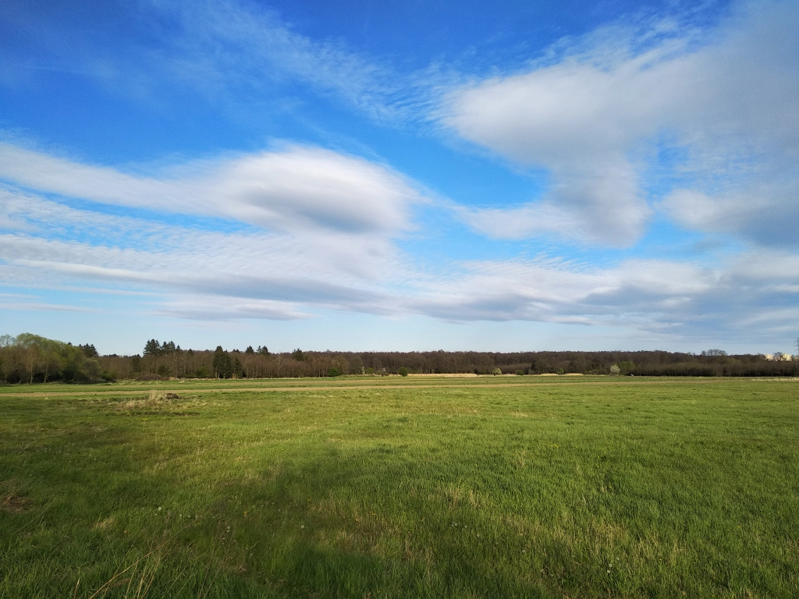
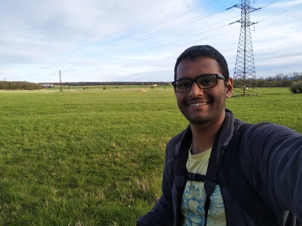

My last Big Day in the Czech Republic was on 8 May 2021. Inspired by friends like Honza, I planned to spend as much time as possible outside in the field. Now this would naturally have meant being outside from midnight to midnight, but due to being caught up with some work throughout the day on 7th and then [twitching for a Red-breasted Goose](https://ebird.org/checklist/S87335928) in the evening, this wouldn’t have been a good idea. Instead I decided to get up such that I would be able to reach my first location about 15 minutes before sunrise (which was at 0531). I didn’t make a detailed plan of locations and times either, but just had a vague idea of where I’d go and which species I’d need to tick from there. And so it began.

I woke up at 0345, getting 4 hours of sleep, and within 10 minutes I had freshened up. I started my first checklist from my dorm room as I prepared lunch and snacks for the day, hearing Fieldfares (**1**), Eurasian Blackbirds (**2**) and a Common Redstart (**3**). I then got ready and before I could get going, I had to make a quick bathroom stop. By 0453, I was walking across campus to collect my bicycle, and heard more species: Lesser Whitethroat (**4**), Black Redstart (**5**), Common Chiffchaff (**6**), European Great Tit (**7**), European Goldfinch (**8**), and Ring-necked Pheasant (**9**). As I started cycling towards my first stop, Šindlovský pond which has an expansive reedbed, I was stopped by a pheasant that was standing in the middle of the road leading out of campus. Only when I slowed the bike to a halt around 2 m from the bird did it move away, giving faint calls. And only then did I realise that it was not the usual pheasant---it was a Reeves’s Pheasant (**10**; lifer #1)! Another species introduced in Europe from China for hunting, this one is much more uncommon, and the only feral population I know of is in the southeastern corner of the country. And so I was very pleasantly surprised to see it! It was a great start to the day. While I was watching the pheasant, I was able to add another species to my tally, the Eurasian Blue Tit (**11**).

<figure>
    
    <figcaption>Beautiful horizon in the early morning, hinting at the sun’s arrival.</figcaption>
</figure>

I got to the pond by 0520 and listened to the European Greenfinches (**12**), Eurasian Nuthatch (**13**), Common Wood-Pigeons (**14**) and Eurasian Collared-Doves (**15**) all calling and singing, along with other birds, from the edge of the pond bordering the village pub and some houses. From there, in the water I could see Greylag Geese (**16**), Black-headed Gulls (**17**) and Mallards (**18**). As I moved along the edge, I saw a Grey Heron (**19**) in flight, Eurasian Jays (**20**) exploring some trees and European Starlings (**21**) moving about noisily. I turned the corner and started along the southern edge of the pond which is lined by the reedbed and also borders some fields. Almost immediately, I heard then saw Sedge Warblers (**22**) singing in the reeds, and heard a Eurasian Blackcap (**23**) and Song Thrushes (**24**). As I reached the fields, I saw Northern Lapwings (**25**) which must have had chicks already---they were very anxious and were alarm calling. I also saw a Eurasian Marsh-Harrier (**26**)---the male of the pair in this area---flying initially low over the reeds but then quite high up. In the distance, I heard a Eurasian Golden Oriole (**27**), Common Buzzard (**28**), Eurasian Green Woodpecker (**29**), Willow Warbler (**30**), Common Chaffinch (**31**), Yellowhammer (**32**) and Tree Pipit (**33**). The latter was singing incomplete songs; it was a nice surprise as I didn’t really know where I could go to tick it.

When I got to the end of the pond, I waited for some time scanning the vast fields. I was able to add another woodpecker, the Great Spotted Woodpecker (**34**), and heard a couple of Eurasian Skylarks (**35**) singing, true to their name, from the sky. I spotted a European Stonechat (**36**), again the male of the pair in this area. There was also a White Wagtail (**37**) calling in flight from somewhere over the water, and some Eurasian Tree Sparrows (**38**) moving about in some of the trees. I then started walking back and noticed a Reed Bunting (**39**) singing a song that was unfamiliar to me. As I scanned the fields some more and watched the lapwings still alert, I noticed two tiny light spots on the ground, that were tinged orange by the rising sun. They were a couple of Little Ringed Plovers (**40**), which I could easily have missed. Finally, as I was about to stop the list and head to my next spot, I heard a Long-tailed Tit (**41**) along with other tits. You always hear them more than you see them.

Next in line was Homolský les, the forest south of Šindlovský pond which connects to Branišovský les where I had conducted my thesis fieldwork. My targets here were some hard-to-get tits and kinglets (Regulus spp.). I also knew of a River Warbler that had its territory on the edge of the forest last year. Unfortunately, it seemed like it was yet to arrive this year, but I lucked out on a Willow Tit (**42**) immediately. A Hawfinch (**43**) flew overhead, then I proceeded to sneak in past the fence into the forest and heard European Robins (**44**) singing. For a while then, I got nothing new until I finally heard Coal Tits (**45**) singing from some trees. As I went behind a group of 4--5 orioles that were flying about in some pine trees, I heard a Common Cuckoo (**46**) in the distance as well as a Common Firecrest (**47**) singing from a stand of spruce. I wasn’t lucky enough to be able to tick the Goldcrest and Crested Tit also from here, so I started walking back. I then heard a Common Grasshopper-Warbler (**48**) singing what seemed like a subsong from some short planted pines. When I got to the spot I had left my bike at, I heard a Wood Warbler (**49**) from the distance.

I rushed back to Šindlovský pond to see if some new birds would greet me after their warmup. Sure enough, I noticed Barn Swallows (**50**) and Common House-Martins (**51**) going about their business in the sky, and a European Serin (**52**) that had joined the orchestra of finches. A pair of Common Shelducks (**53**) arrived at the pond, and a pair of Tufted Ducks (**54**) was out in the open water. The trees between the pond and the fields now had a singing Greater Whitethroat (**55**), and the fields themselves had a Mistle Thrush (**56**) foraging. Right as I was about to end the observation, I noticed a female flycatcher flitting about near some of the houses. I took some photos, and afterwards identified it as a European Pied Flycatcher (**57**). Finally, I added House Sparrows (**58**) that were active in the village, before leaving for my next spot.

It was now almost 0800, and I was supposed to meet Inga, Leo and Joel in the city centre---we had plans in the land of fishponds, Třeboň. So, I wanted to leave my bike in the university campus. On the way though, as I cycled through the fields beside uni, I saw Rooks (**59**) and Eurasian Jackdaws (**60**) and heard some Eurasian Magpies (**61**) as well. However, as I was observing the Rooks to check for Carrion Crows, I noticed a few silvery blobs darting around on the ground. I looked closer and saw black head stripes and even a slight orange buff on their breasts. Northern Wheatears (**62**; lifer #2). Ever since Inga had spotted one in the same fields a few weeks earlier, I had been trying and failing, but here were 3 beautiful birds, their colours accentuated in the early morning sun! I watched them for a short while and got satisfactory photos, then moved on. 

<iframe src="https://macaulaylibrary.org/asset/336871531/embed" height="343" width="320" frameborder="0" allowfullscreen></iframe>

<iframe src="https://macaulaylibrary.org/asset/336882771/embed" height="316" width="320" frameborder="0" allowfullscreen></iframe>

I parked my bike and started walking towards the city while also having a very light breakfast, a cookies-and-cream-flavoured croissant. I saw a bright pink Eurasian Linnet (**63**) as well as the first Common Swifts (**64**) and Rock Pigeons (**65**) of the day. I chuckled at how the pigeons were the 65th species. I had almost finished the croissant and had reached the tiny church before the main junction, when I heard a Short-toed Treecreeper (**66**) singing. I couldn’t figure out from where---probably one of the few trees nearby, but I found it very strange that a treecreeper was in such a place and singing! I kept going and waited at the weir for a few minutes, aiming for the usual Grey Wagtail and the more uncommon Common Kingfisher. The former (**67**) came out from hiding soon enough, but I had no luck with the latter. I eventually met up with Inga and Leo who were ready with the rental car and visibly excited, and Joel joined us shortly. We were all pumped and our first stop was an attempt for bee-eaters at a recently renovated sand pit and quarry area where they would likely breed. It was going to be a game of luck, as we had not heard of anyone who had reported them there this season.

Thus, I ended my first 4--4.5 hours of birding with a total of 67 species, although technically 9 hours were already over. I was quite pleased with my morning session until I checked the leaderboard on eBird and saw Honza who was already at 89, but he had actually been birding since midnight so I wasn’t too mad. Besides, it’s not like I even hoped to beat him at any point :D. But I was putting up a good fight!

We arrived at the sand pit and quarry near the village of Mladošovice by 0935, and decided to park the car and walk the short distance to our target quarry. Before Leo, our designated driver, could even switch off the car, some interesting and vaguely familiar form caught my eye. I swiftly looked through my binos at the few leafless trees that stood barely a few metres from the car, and couldn’t believe my eyes. I lowered the binos for a quick blink and reset and held them up again, then exclaimed expletives---there were 2--3 European Bee-eaters (**68**; lifer #3) sallying right in front of our car! Everyone saw them and quickly got out to get better looks. It had been close to 2 years since I last saw the genus Merops, and boy, was this species a beautiful one! The view didn’t last long though, and the birds soon took to the sky. Inga then spotted a much larger flock of them farther away in the sky, leading to a total of around 17 bee-eaters! (I later realised that Honza along with 3 of his friends had seen exactly 17 birds in the exact location last year on exactly the 8th of May. How cool is that!)

Our morning was already made. We tried to check the original target location anyway, and saw a corvid battle between Common Ravens (**69**) and Carrion Crows (**70**), as well as a White-tailed Eagle (**71**) high up in the sky. We saw no more bee-eaters so turned back and saw a pair of Eurasian Kestrels (**72**) hunting in their typical fashion. On the way to our next stop, we faced some road work which forced us to take a detour, and we ended up spotting, among other birds, a pair of Common Goldeneyes (**73**) in a small village pond. We finally got to Svět, a very large fishpond in Třeboň. As we walked along the side of the pond, we got the first of the many Collared Flycatchers (**74**) of the day. There wasn’t much activity of ducks in the pond, but we saw a few Common Pochards (**75**), Gadwalls (**76**) and Red-crested Pochards (**77**). We were sort of exploring spots, and this one wasn’t too great, so we decided to move on. We saw a Hooded Crow (**78**) flying around and also a Black Woodpecker (**79**) that gave its croaking flight call.

Next, we ended up making stops at several ponds that were adjacent to each other. At Starý Vdovec, there were some Great Cormorants (**80**) and Common Terns (**81**), and a Red Kite (**82**) that flew over. Inga also noticed a flycatcher that sounded different, a Spotted Flycatcher (**83**). At Nový Vdovec, we stopped at two locations. At the first, I saw my first Great Crested Grebes (**84**) of the day and a couple of Marsh Tits (**85**) that were busy bringing food to their nest. At the second, I got my first Mute Swans (**86**). Soon after we departed from this pond, we came across a drained pond which now had a small stream of water coming in, forming what looked like an amazing spot for waders. We stopped yet again, and sure enough, we could see tens and tens of waders. 

Right as I got out of the car, I heard the striking flight call of Common Greenshanks (**87**) and saw some waders flying off to the far end. The problem was, none of us had scopes. The sun was shining bright and helped combat the cold winds, but right now was kind of a nuisance. We were on the wrong side of the waders and had a hard time observing them. Nevertheless, we realised that a large majority of them were Wood Sandpipers (**88**), while there were a handful of Little Ringed Plovers too. I had by now enough experience birding Czech fishponds alone with no scope, so I utilised my tactic of taking loads and loads of pictures. This itself proved a bit difficult because of the sun, but I managed somewhat. Later, as I analysed the photos, I noticed 3 stints among the sandpipers. The photos were poor to decide between Little and Temminck’s although it seemed more like the latter. I eventually found another photo in which the bird was in a slightly different position. From this, the bird seemed to be quite dark overall with a fairly distinct breast band, suggesting, with decent confidence, Temminck’s Stint (**89**).

We then got to the village of Lutová, from where we walked to the nature reserve Staré Jezero. We stopped amidst some ponds just before the reserve and had lunch surrounded by lively *Bombina bombina* and cuckoos that almost seemed like one of them. There was a Great Reed Warbler (**90**) ‘singing’ from some reeds. After lunch, we started off on a walk around the reserve. The ponds didn’t bring anything new, but I was able to tick two common species in the trees lining the ponds: European Treecreeper (**91**) and Eurasian Wren (**92**). Inga’s sharp ears also caught a faint Savi’s Warbler (**93**; lifer #4), but a couple of particularly loud dirt bikers had decided that this nature reserve was the best place to hone and show off their skills, and so managed to put off both the warbler and us.

While on our way to the final spot for the day, we came across yet another pond that seemed to be inviting us, and for good reason. At Koclířov pond, there were around 60 Black Terns (**94**) along with other terns and gulls! We also saw a couple of Common Sandpipers (**95**) flying slowly near the edge of the pond. Inga spotted a Greater White-fronted Goose (**96**) as it landed among a couple hundred greylags on a field on the opposite side of the road, and although she struggled, she did manage to spot it again and we were all able to see it. It was probably an individual that had sustained an injury of some kind. It was holding its wing in a weird way.

When we finally arrived at Velký a Malý Tisý, I noticed a Caspian Gull (**97**). There were also some warblers singing from very sparse reeds. We thought they were Sedge Warblers at first, but later saw the birds and realised they were (nest-building) Eurasian Reed Warblers (**98**). That just confused me more about their songs. As we were caught up with the warblers, I noticed a large form gliding over the pond recalling a stork or crane. It was a Black Stork (**99**; lifer #5)! We were now running short on time since we had to return the rental car, so we hurried ahead on the lookout for the last ‘Black’ bird, the Black Kite. Luck wasn’t with us on that one, but we ended up hearing a Common Nightingale (**100**) and also got a Garden Warbler (**101**) and a Green Sandpiper (**102**). By 1710 we decided to head back, and were able to return the car at 1752, 8 minutes before the deadline. I parted with Inga and Leo but continued my Big Day. Joel had decided to join me for some more time, and we had agreed to meet back at the Vrbenské ponds. 

<iframe src="https://macaulaylibrary.org/asset/336885291/embed" height="301" width="320" frameborder="0" allowfullscreen></iframe>

<iframe src="https://macaulaylibrary.org/asset/336915591/embed" height="301" width="320" frameborder="0" allowfullscreen></iframe>

My skin was feeling filthy by now so when I went to pick up my bike again, I quickly stopped at the washroom near my supervisor Katka’s office and washed my hands and face. I was refreshed. I had planned to twitch once more for the Red-breasted Goose, and I did so successfully. The bird (**103**) was still there but unfortunately I did not have time to take in its beauty. I also spotted some Egyptian Geese (**104**) nearby. After checking some places on the way for anything special, I met back up with Joel. I saw the usual Mediterranean Gulls (**105**) and recognised at least a couple of Yellow-legged Gulls (**106**) among the big Larus gulls which were mostly Caspians. We spotted 2–3 Garganeys (**107**) swimming close to the far edge of one of the ponds, and I finally got my first Eurasian Coots (**108**) of the day. Meanwhile, a couple of Eurasian Spoonbills (**109**) flew overhead. This was a species it’d have been shameful to not tick, given I was birding in South Bohemia: the Vrbenské ponds are their only breeding site in the whole country!

We kept scanning the water for more birds, like the two more grebes we had yet to tick. Instead, we first spotted 2 Eurasian Moorhens (**110**). Joel did end up spotting some grebes, but they were hidden behind fallen trees and we couldn’t really tell which species of the two it was. But he felt they were Little. We ended up walking around to the other side and spotted the usual Black-crowned Night-Heron (**111**) colony together with that of the spoonbills. A nice surprise was a Little Egret (**112**) amidst the spoonbills and a Grey-headed Woodpecker (**113**) calling loudly from very close to us. Joel was elated at this field day for woodpeckers, as he had had horrible luck with them so far. We finally got to the other side of the grebes and got a clear view, when we were able to notice the weirdly shaped head of the Eared Grebe (**114**). We were hoping for shovelers too but couldn’t spot any.

The third grebe was still missing, but I was almost certain that we would get one if we waited till dusk at one of my favourite spots there---a couple of benches overlooking the Bažina pond where we could rest for a while and munch on some snacks. That is what we did, and like I’d predicted, the pair of Little Grebes (**115**) alerted us to their presence with their calls. A little after sunset, we got moving again, with no specific bird in mind but hopeful for some surprise. We heard a warbler-ish song coming from some shrubs bordering fields, but I had a strange feeling about it. I suggested we wait and listen to it longer, and my suspicions grew stronger. I decided to try playback a couple of times, and to our pleasant surprise, it responded! It was a Bluethroat (**116**) singing from the exact spot I had seen it a few weeks ago! This was the best possible ending, and Joel and I parted at around 2130.

I wasn’t done, though. I was hopeful for some crakes and owls, and perhaps even quails. I headed to Čejkovický pond, ears alert all the way. There were some funny sounds, but none that I could link to a bird. It was now completely dark, and due to a mishap earlier that day with the holster for my bike light, I had to use to my phone torch and move along slowly. At Čejkovický pond, I put down my bag, leaned back against it and looked up at the clear sky glittered with stars while listening to the birds (for there was still decent activity). The white glitter on black velvet was inviting me for philosophical reflection but I had to turn down the offer. After a few minutes, I tried playbacks of different crakes (with gaps in between), and finally a Water Rail (**117**) sang back from a long way away. There is a small part of me that fears it was simply a hallucination though, as it responded just once.

It was getting late. It was now 2230, and I decided to try to fix the light holster to have some chance of sticking to my plan on time. It worked, and I was now flying along the trail to Novohaklovský pond. There was nothing new there except for some very loud and energetic frogs. When I got to the edge of the fields before Branišovský forest, I stopped for a bit to listen. And I heard Long-eared Owls (**118**). It was another surprise, as I wasn’t expecting them here. There were at least 3 owls calling and responding to each other. It turned out well that I got them here, as I didn’t end up hearing any in the forest which was what I had planned on. As I cycled through the forest, due to the stories I had learned of recently, I couldn’t help but imagine stumbling upon a dead body hanging from a tree. It wasn’t so much a scary thought as it was distracting.

I got to the fields beside uni by 2310, in a state of total confusion. Just before I had reached, as I was moving along swiftly on the road, I had noticed a long line of stars moving along in the sky! And they were still moving. I obviously couldn’t believe my eyes and I assumed I was hallucinating after the long day. I pinched myself to be certain. I was definitely awake. It had to be real. I stopped questioning it and instead tried to take it in. This insane train of satellites was passing for at least 3–4 minutes, which meant there must have been at least 50 satellites. It was just an amazing sight. (I later learned that it was Elon Musk’s doing: SpaceX’s Starlink satellites.)

Anyway, I moved on, exhausted. Frogs were partying somewhere, making me think of crakes. However, apart from a nightingale that gave a short section of its song, the rest of the Day was uneventful. I parked my bike at 2349 and walked around the campus looking for the resident owl, but again with no luck. So, finally, at 0000 I stopped my final checklist and went up to my room. I took a long warm shower and also made sure to eat something before crashing. 

Global Big Day 2021 was my best Big Day yet. I enjoyed the endurance-style challenge of being out for as long as possible, and I intend to step it up a notch or two in the following years. I ended up with 118 species in 24 hours (though I did only 19.5 hours of birding) and ranked 7th in the country, which is not too shabby at all! A lot more Czechs have now started using eBird so it speaks to at least something. Honza ranked second (125 species) which was a surprise to me, but this year his focus was restricted to his region of Central Bohemia. Regardless, I am quite pleased at how close I came! I had immense fun birding alone as well as with my friends. I got to see great species, even some lifers. Yes, I did miss out on some pretty common species, but that’s how it goes, one will always miss something. At the end of the day, being able to spend this much time with birds with no other worry in the world is all I can ask for. 

<figure>
    
    <figcaption>Yes, I struggle to smile properly in selfies.</figcaption>
</figure>

And with that, I finished my final Big Day in the Czech Republic. The prospect of leaving this country after a wonderful two years brings with it many emotions of course, but most of all I am just grateful for all that I have learned and experienced, as well as the amazing people I have met, because of birds. It is also sweet knowing that even after I leave, my birding impact will remain if only as numbers and records on eBird. :)
