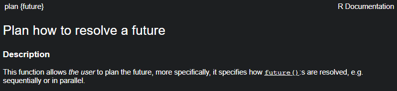
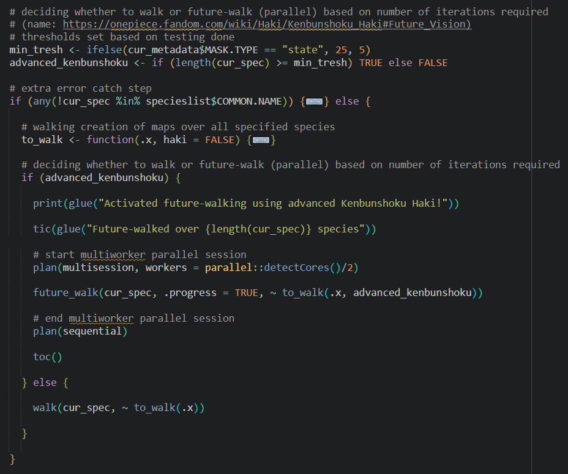
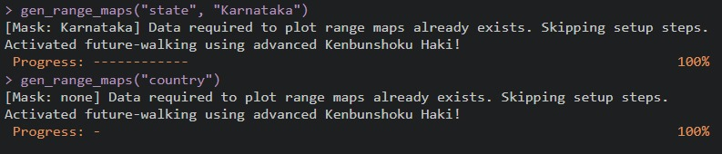
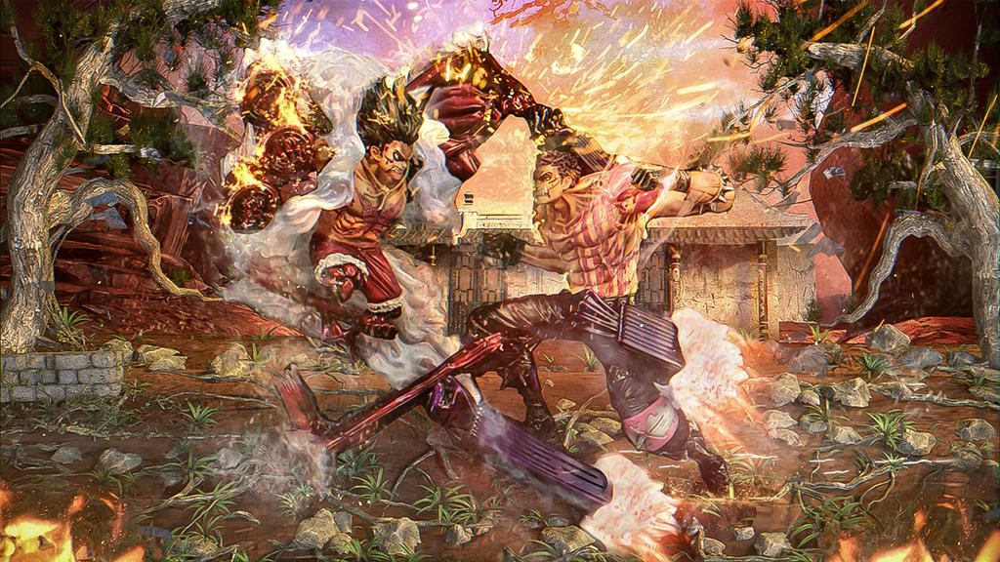

#### SPOILER WARNING!

This blog post contains spoilers for One Piece (Whole Cake Island onwards). Continue reading at your own risk!

***

I have previously alluded to the interesting perspective of life as a series of chapters or arcs in a shounen anime, and of my own timeskip (see [here](https://kartrick.rbind.io/blog/07_turnofyear/)). In One Piece, after Luffy's timeskip, he has great adventures with Trafalgar Law, as the two pick a fight with Donquixote Doflamingo whilst on their way to the top brass. But arguably, his first *big* challenge after the timeskip is when he squares off against Charlotte Katakuri in his attempt at rescuing his dear friend from the political manoeuvring and puppetry of the ruthless and power-obsessed madwoman, Big Mom.

The strongest member of the Big Mom Pirates after the captain herself, Katakuri poses an almost insurmountable obstacle. Luffy struggles to keep up with his attacks, as he can predict every single movement of Luffy's and effectively counter it. As the battle progresses, Luffy discovers that Katakuri is using the advanced form of Kenbunshoku Haki (Observation Haki), which allows the user to literally [see a precise mental image](https://onepiece.fandom.com/wiki/Haki/Kenbunshoku_Haki#Future_Vision) of what will happen a short period into the future. As with many advanced powers in the One Piece world, Future Vision cannot be obtained simply by training, and has to be awakened in the heat of extremely trying battle. Luffy eventually awakens this ability himself in this same battle, and joins Katakuri, Kaido and Shanks as one of the only four known users of this advanced ability.

<figure>
    
    <figcaption>Katakuri using foresight to avoid enemy attacks.</figcaption>
</figure>

One the biggest and most complex projects I have been part of has recently drawn to an end. The [State of India's Birds (SoIB) 2023](https://stateofindiasbirds.in/) report---which is a comprehensive assessment of distribution range, trends in abundance, and conservation status, for 942 Indian bird species---was officially [released](https://www.youtube.com/live/gJgXuRPl9vg?si=XMtOT9BxT3jwE-F_&t=344) on 25 August 2023 in Delhi. This was a mammoth endeavour, and was challenging in many different ways, but the aspect I will focus on here is the sheer scale of everything, and how this helped me awaken an advanced ability.

The analysis of eBird data that forms the crux of this report is of massive scale. It uses 30 million observations from 30,000+ observers. It includes multiple complex models that derive population trends from an abundance index and range sizes from observed and modelled occupancy; algorithms that categorise status and classify conservation priority; and all of these analyses repeated across numerous scales, from the whole country to habitat masks to individual states. 

It is not surprising, then, that we were running on a very tight deadline towards the later stages. Even after the models had run (for literal weeks on end), and metrics of interest had been derived from the model results, all these needed to be communicated visually in the form of trend graphs and range maps. This meant that multiple plots needed to be generated for every species, and these steps had to be iterated several times for each of the many scales of interest. After considerable work, I had successfully functionised the plotting, so all that was left was their Great Iteration.

My plan was to `purrr::walk()` the function across species within masks and across masks. In the case of the range maps, some back-of-the-envelope calculations from walking it across a handful of iterations had told me that it would take 9.2 hours to generate range maps for all 942 species at the level of the whole country---it took around 35 seconds to generate one map, with the bottleneck being the `ggsave()` step because we were using a fine-scale DEM basemap. It would then take a further 9.4 hours to produce maps for all other habitat masks and states. 

I still had a fraction of time to spare from `\(t_{0}\)`, so I decided to play one more card and see how it went. The craziest power-ups do truly occur in the heat of battle. 

I had come across the `furrr` package several times before, but never gotten around to trying it out---mostly because I was still grappling with the `purrr` logic and syntax, and fighting against those of the regular `for` loops. I had gained a decent understanding of `purrr` in the course of working on SoIB, so I took a leap of faith. And, boy, did it work wonders! I quickly realised that everything I had been doing with `purrr` had an equivalent in `furrr`; and the plotting steps were boringly sequential---unlike the trend modelling whose bootstrapping was already parallelised, and so couldn't be further parallelised across species and scales---and therefore could be made magnitudes more efficient with parallelisation.

`furrr` is a beautiful chimaera of the packages `future` and `purrr`. Sitting in front of my monitor with groggy mind and aching shoulders, I was transported into an anime realm when I started reading about its inner workings. The basic one-two of my newly gained `furrr` power involved me first planning out a future, and then walking my desire across that planned future. 

<figure>
    
    <figcaption>My newly gained power involved me first planning out a future, and then walking my desire across that planned future.</figcaption>
</figure>

In other words: first setting up the parallelisation, then iterating the function of interest using `furrr`'s counterpart to `purrr::walk()`. Since any advanced ability (such as advanced Kenbunshoku) is extra draining and demanding to the user, I set up a check to decide whether or not to activate my Future Vision (Walking).

<figure>
    
    <figcaption>I asserted higher control over my Haki so that Future Vision only activated when required.</figcaption>
</figure>

I only realised the full scope of this newfound ability when the range maps for all species in the country finished plotting---and it didn't take long. My naive estimate of 9.2 hours was absolutely decimated: all 942 maps were plotted in 19 minutes! I was initially just amused; later, I realised that the problem had now flipped and I now had to catch up with this future-walking and finish the rest of the code in time. Eventually, I was in a daze and felt like I had almost become mad with power!

> I can see a bit into the future, too... I saw that I was going to beat you!
> --- Monkey D. Luffy

<figure>
    
    <figcaption>Walking my desire across the planned future, using my newly gained and ridiculously strong ability.</figcaption>
</figure>

The strength of Haki varies from user to user. Katakuri's advanced Kenbunshoku was still stronger and more refined than Luffy's, of course. When I moved from testing the new plotting workflow on my laptop to running the full thing on our server, the difference became strikingly obvious. But luckily, the server was on my side, and I watched the progress bar tick and bathed in its glory. 

This power-up made me feel reborn. My new ability to walk the future opens up so many possibilities, and I look forward to mastering it!

<figure>
    
    <figcaption><a href="https://www.deviantart.com/mada654/art/Katakuri-Vs-Luffy-Snake-Man-765633030">Katakuri Vs Luffy / Snake Man</a>, by mada654 on DeviantArt.</figcaption>
</figure>

