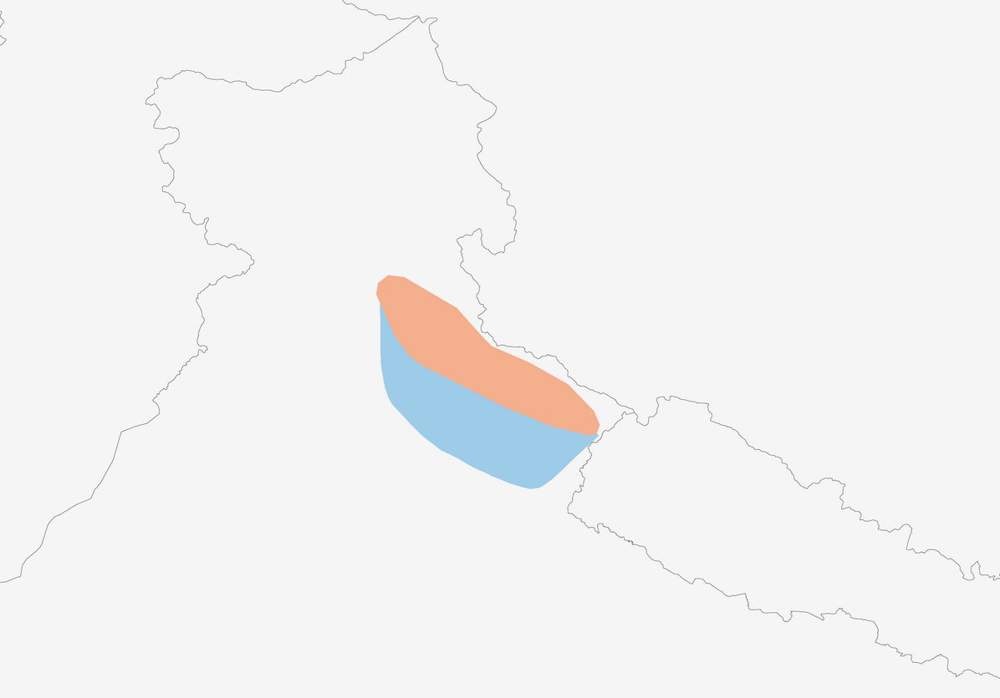
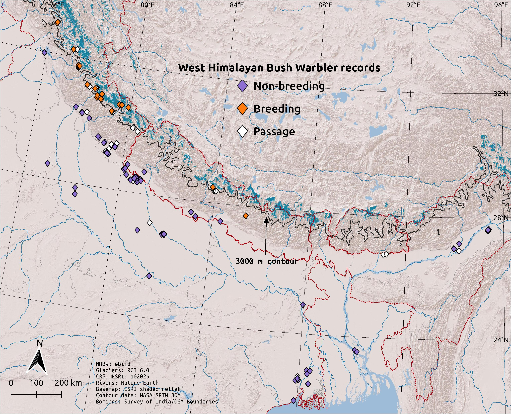

Having started birding in India, it was Europe that made me [fall in love with warblers](https://kartrick.rbind.io/blog/07_turnofyear/#birding-in-2020). Among them, those of the genus *Locustella* particularly took my heart, due to their mesmerising songs that so perfectly emulated orthopterans. There were three species I ran into during my time in Europe, all with surprisingly distinct songs.

<iframe src="https://macaulaylibrary.org/asset/229576271/embed" height="432" width="640" frameborder="0" allowfullscreen></iframe>
<iframe src="https://macaulaylibrary.org/asset/243291031/embed" height="432" width="640" frameborder="0" allowfullscreen></iframe>
<iframe src="https://macaulaylibrary.org/asset/327626141/embed" height="432" width="640" frameborder="0" allowfullscreen></iframe>

Given that I was captivated enough by this genus to boldly declare, in June 2020, that "my favourite warbler will be *Locustella* for a long time", I was naturally elated when I found myself entwined in a web of mystery around a different *Locustella* in an altogether different part of the world! This story started in May 2022 with one very intriguing serendipitous sighting which, unbeknownst to us at the time, was but the first of a series of dominoes. The story started growing in scope, with tiles falling down one by one all across the Ganga-Brahmaputra plains of northern India and Bangladesh, until birders eventually found that much of what was thought to be known about the species required overhaul.

This long and intriguing story, itself simply a gestalt of numerous, equally intriguing mini-stories, has been two years in the making but is now finally out in all its glory! In this post, I attempt to provide a TL;DR better populated with raw excitement and wonder.

*Indian BIRDS is a &#x1f48e; OA journal, so the PDF can be downloaded for free from  [here](https://indianbirds.in/wp-content/uploads/2024/09/IB_20_3_ThrikkadeeriETAL_LocustellaJigsaw.pdf).*

## The first domino

It all started with a safari on 30 May 2022 in the Terai grasslands of Manas National Park, Assam. The five of us had been [enjoying the wonderful specialist birds](https://ebird.org/checklist/S111778411) and the beautiful habitat, when we happened to notice a repeated insect-like vocalisation. We all converged on the same *jizz*, suggesting that this was something interesting. We took our time with it, and eventually succeeded in calling it closer. The region has no dearth of wintering *Locustella* species, but none of the four likely ones seemed to match our bird. Plus, it had practically breached summer at this point, so what was a *Locustella* even doing here?!

We were unable to find a perfect match for the song the entire day. The next morning, however, an epiphany struck Ashwin (where most epiphanies strike); he cross-checked and realised that our mystery bird was in fact a species thought to be endemic to the western Himalaya, whose closest known record was over 600 km away to the west---the West Himalayan Bush Warbler (WHBW)!

<iframe src="https://macaulaylibrary.org/asset/515740991/embed" height="432" width="640" frameborder="0" allowfullscreen></iframe>

## The bigger picture

While this was an absolute shock to all of us, we were left with more questions. Most pressingly, why did we find this species so far away from its previous easternmost record? And why was it still here so late in the season, when its supposed breeding range which starts only from west-central Nepal was so far away?

<figure>
    
    <figcaption>Previous distribution map of West Himalayan Bush Warbler. <a href="https://birdsoftheworld.org/bow/species/spobuw2/cur/introduction">Lynx Edicions/BirdLife International</a>.</figcaption>
</figure>

Over the course of the next two years, knowledge about this species grew rapidly. Various individuals and groups of birders all across the northern parts of the subcontinent (whose full list you can find in the paper) independently stumbled upon individual pieces of the jigsaw puzzle. This species, once thought to be a western Himalaya endemic (see map above), brought itself into clear view as a widespread winter resident of a majority of the floodplain grasslands of northern and northeastern India and Bangladesh! See the map below; the West Bengal records currently serve as a midpoint anchor for the full wintering range of the species, with the gaps to its northwest and northeast being presumably due to insufficient exploration.

<figure>
    
    <figcaption>Current known distribution of West Himalayan Bush Warbler. Map by Chintan Sheth, Ashwin Viswanathan and Karthik Thrikkadeeri.</figcaption>
</figure>

As for the first question, it became clear that a combination of low birding in some regions and challenging identification during winter when they rarely sing (contact calls are extremely similar between most sympatric *Locustella* species), simply didn't bring enough opportunities for such encounters. The sheer number of eyes and ears out on a regular basis, on a figurative hunt for birds, has risen dramatically even in the last two years. In addition, the domino effect was facilitated by the network of WhatsApp and Facebook birding groups where such sightings were discussed at length. This was crucial, as it brought this coveted surprise on the radar of exploring birders.

While the second question is yet to be fully answered, there is some understanding that spring migration happens rather late in WHBW. Nevertheless, there is also reason to expect hitherto undiscovered breeding populations of this species in the high reaches of the Himalaya much further east of Nepal. Accessibility to such regions is a major issue for birders, but there are some pockets which might be less challenging than others. 

I've grown fond of the name West Himalayan Bush Warbler, but it does stand out like a sore thumb, as does the alternative Kashmir Bush Warbler. My inner child considers options such as Terai Bush Warbler or Floodplain Grasshopper Warbler, but isn't it rather iconoclastic to name a species after its non-breeding range rather than its breeding range? So I might settle for the more modest Himalayan Grasshopper Warbler, although I still don't know whether this group of birds resembles more grasshoppers or locusts (or maybe crickets? Imagine Himalayan Cricket Warbler *Cricketella himalayensis*!).

## The highs of birding

As I am reminded time and time again, one of the best things about birding is that it is a perennial series of trysts with chance, with stochasticity. This can mean stumbling upon something extraordinary, like the WHBW in Manas, but also *not* stumbling upon something extraordinary (like the countless [dips](https://www.audubon.org/news/birdist-rule-81-learn-how-handle-your-first-dip) of a birder's lifetime). Without getting too metaphysical, or even probabilistic, it is simply about being present at the right place and time. And part of the birder's job description is what in other contexts is described as spreading out one's surface area for chance to strike.

The element of surprise---of serendipitous discovery, of stumbling upon the improbable---is one of the greatest highs this lifestyle gives. Some surprises are more jawdropping than others, but all are sure to make the day and leave one with a deep sense of fulfilment. When even the worst case is that one learns something new about something familiar, not to mention the added meditative bonuses, this is a vice I am more than willing to gamble with.
