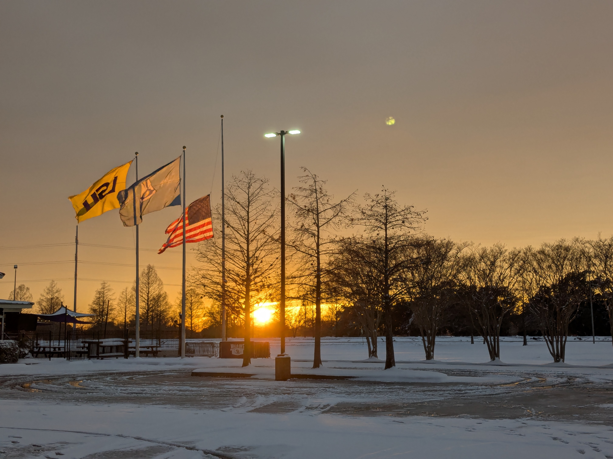

> He said, "I write what I see  
> Write to make it right, don't like where I be  
> I'd like to make it like the sights on TV  
> Quite the great life, so nice and easy."
>
> --- Lupe Fiasco, Hip-Hop Saved My Life

<figure>
    
    <figcaption>Snowstorm in Baton Rouge, 21 January 2025.</figcaption>
</figure>

Although I can recall many days chanting [*apple bottom jeans*](https://www.youtube.com/watch?v=U2waT9TxPU0) and [*crank that*](https://www.youtube.com/watch?v=8UFIYGkROII) on loop as an eight-year-old, it wasn't until I was 13--14 that I started listening to rap music more broadly, in earnest. I had asked a friend for a copy of Pokémon Emerald, and he gave me the emulator setup on a pen drive that, incidentally, also included a bunch of music by Eminem, Akon, Lil Wayne, and others. My rap library very slowly grew through my school days, in which time I would also engage in toxic Eminem vs Lil Wayne debates on Facebook: my edgy teenage self arguing that Weezy was *so much* better than Eminem---not really knowing what I was talking about---whilst bopping to Rap God and MMLP2 behind the keyboard.

My undergraduate days left rap on the sidelines a little bit, mostly because few people around me were into that music aside from the radio hits. My friends did have some good music taste though, and my musical horizons definitely broadened for the better during that time. I did, however, still indulge in rap when I could, and importantly, discovered the growing rap culture in India with artists like [Brodha V](https://youtu.be/pxCWiYFkvTg?si=T7AQCQEByGT2F0eC) and [All Ok](https://youtu.be/ksANu45I16U?si=ck9JYnR_wts1T6-M).

I had much more time to myself during my master's, which also included the COVID-19 pandemic months. This period was the real gamechanger, reigniting the genre's many embers I had fallen in love with in the first place. Curiously, it was a backwards loop: I discovered many of the [latest trap hits](https://www.youtube.com/watch?v=OWl9p3oFKgg), and started curating a Spotify playlist of my favourites at the time; eventually, I got recommended more rap, like [The Game by Russ](https://www.youtube.com/watch?v=XeHQGVw5xf4); some of the catchy TikTok hits also stuck with me, and I even discovered rap artists from Kerala. An open-minded friend patiently listened as I rambled on in translating the rhymes, wordplay and entendres in [Morumvellam](https://youtu.be/PgVlBaKnVgg?si=ZewDNSqMZ6pXHLNC). Before I knew it, I was going back to my old favourites and adding them to my playlist. My friends from France and Italy introduced me to unique European artists; my New Guinean friends brought the taste of classics like [Bone Thugs-N-Harmony](https://youtu.be/LIb6M75ZMRQ?si=5UwTJW_EMmE7J42H) and also showed me [Tok Pisin reggae/rap](https://youtu.be/td38GeHaMOk?si=zVjfQvRkQXt5qlU2). I discovered [YouTubers](https://www.youtube.com/@KnoxHill/featured) who discussed and broke down rap music. Safe to say, by now rap had transcended beyond a genre I liked, and had become *my music*, my thing.

Fast-forward to the present day: I identify as a hip-hop head [^1] [^2]; rhythm is internalised to the extent that I can't help but bob my head to even genres like Carnatic music; my [ever-growing rap playlist](https://youtube.com/playlist?list=PL1BRV4y5o32DgL5l5O5UzeOEx-o1roBaw&si=I5XMJRwZxIR0F42P) currently stands at 739 songs from at least five continents; [stank faces](https://www.reddit.com/r/EDM/comments/1ff56xy/what_is_the_origin_of_the_stank_face/) are a regular occurrence. The trinity of [J. Cole](https://youtube.com/playlist?list=PLA43DqAcT2MGquM10U3Aa1McZ8zboDT42&si=FanOqHyBMVdNtH5g), [Kendrick Lamar and Drake](https://youtube.com/playlist?list=PL1BRV4y5o32AUZWHDdTqVBgBazGmCScqH&si=wMrJ3lh2_JXYCV2v) kept me pushing through 2024, the most difficult year of my life.

## Feeling rap

[Knox Hill suggests](https://www.youtube.com/embed/U49hnFzmFnc) that there are six main facets to a rapper's skillset:

1. Rhyme 
2. Cadence
3. Flow
4. Storytelling
5. Bars [^3]
6. Artistry

I really like this perspective, and it is an excellent sneak peek into just how intricate the craft of rap music really is. For me, these six elements are further grouped into two distinct themes I'm passionate about.

### Magic in words

During my school days, I had picked up writing as a (questionable) passion. I was writing cringeworthy blog posts regularly, and was also attempting weird rap-poetry chimaeras about my mushroom haircut and chaotic classes [^4]. Point being, rhyming was something I was naturally interested in, and storytelling and wordplay were things I had started paying attention to.

Over the years as my reading has broadened and my views have distilled, the line between poetry and rap has gotten clearer but also murkier at the same time. Part of the latter line of reasoning is that both art forms to me are fundamentally about the endless magic and beauty in words; as many have stated, the challenge of putting together the practically finite set of words in a language in new combinations to unlock surprising layers of meaning is incredibly enticing and rewarding. Embracing the craft is almost like embarking on a ceaseless quest of discovery. 

This magic is what shapes my taste in poetry, and is also responsible for my disconnect with much of contemporary poetry that has intentionally and emphatically strayed away from the use of *poetic* devices---poetry which often feels dry, empty, and half-assed to me. To be sure, I'm not wishing for the rule of iambic pentameter or for rigid poetic forms---but there are plenty of ways for verses to be alive and gilded with core poetic[^5] elements, while still staying contemporary. Rap has certainly figured out how to do so, and is a prime example of how to evolve while still staying true to the roots.

I find myself coming back to Richard Feynman often; his brilliant articulation of how two different, perhaps orthogonal, perspectives need not *take away* but can rather *add* to overall beauty:

<iframe src="https://player.vimeo.com/video/55874553?badge=0&amp;autopause=0&amp;player_id=0&amp;app_id=58479" frameborder="0" allow="autoplay; fullscreen; picture-in-picture; clipboard-write; encrypted-media" style="position:absolute;top:0;left:0;width:100%;height:100%;" title="Richard Feynman - Ode To A Flower"></iframe>

Rap deepens my endless fascination for words and blows my mind by showing me just how much magic and beauty a single language holds. 

### Musicality

My parents had tried valiantly to uncover my latent musicality, unfortunately in all the wrong ways: I took singing lessons in Indian classical music for close to a year, and also tried learning keyboard and guitar but these lasted even shorter. When none of these worked out, they resigned to the conclusion that I was just amusical (although I believe they were told my rhythm was not all that bad).

Today I am so smitten by rap music, I have started delving into music theory from this perspective! I have finally started *understanding* musical terms and concepts I've been hearing in passing forever. I now comprehend musical instruments. Music has taken on life! Rap has shed light on the beautiful mathematics underlying all music (callback to Feynman!), how [repetition is at the core](https://www.theguardian.com/music/2016/apr/29/why-we-love-repetition-in-music-tom-service)---repetition not just of words but also in how music is formulated!

Here's Mazbou Q demonstrating the popular notion that lyrics in rap act as their own instrument. 

<iframe height="315" width="560" 
src="https://www.youtube.com/embed/M_Mn7NzM9is" 
title="YouTube video player" frameborder="0" 
allow="accelerometer; autoplay; clipboard-write; encrypted-media;
gyroscope; picture-in-picture;
web-share"
allowfullscreen></iframe>

It is the specific patterning of lyrics with the music that comprises *flow*: how syllables have been combined with musical notes, how they are stressed and unstressed, and how they are placed in relation to the underlying musical measure. Naturally, other elements such as rhyme and cadence also affect flow and, in the best cases, create beautiful synergy. Here's a bonus example illustrating the rhythmic technique Eminem used in Gnat, where the flow is emphasised by his assonance and matching stressed cadence (notice the accented *o* sounds):

<iframe height="315" width="560" 
src="https://www.youtube.com/embed/ALySO9XhrC4" 
title="YouTube video player" frameborder="0" 
allow="accelerometer; autoplay; clipboard-write; encrypted-media;
gyroscope; picture-in-picture;
web-share"
allowfullscreen></iframe>

A final callback to Feynman: there are so many dimensions to rap music, and learning more about the complexities *only adds* to its beauty. Not only have I been learning music theory through rap, but I've also begun to appreciate other genres better. Legends like [Harry Mack](https://youtu.be/84Ex2iEIHHg?si=HVqK46RzzUJMEZVL&t=144)[^6] have also inspired me to look further into the history of rap, such as its deep connections to jazz and the broader Black American culture, and improvisation as an art form and the technicality of it, among other things.

## What the culture feelin'

It is February 2025, and I have moved to the United States for my PhD. Here, it is a time when daily life seems more bizarre than worlds of fantasy, and not in the positive way. However, it is also the time that rap music has reached arguably greater heights than ever before. Kendrick Lamar has topped off his generational run that started last year and cemented his legacy as one of the greatest, with yet another Grammy sweep and, more importantly, a Super Bowl halftime show performance that has rattled supporters and salty critics alike.

The social messaging is lost on the right crowd, as expected. There is sweet irony in society reacting in exactly the same way that Uncle Samuel Jackson preempted, and in their whining about lack of diversity in the all-black performance just days after hailing [Trump's executive order that ended DEI programmes](https://www.whitehouse.gov/presidential-actions/2025/01/ending-radical-and-wasteful-government-dei-programs-and-preferencing/). Nevertheless, the message *has* reached many new welcoming audiences, loud and clear. 

<figure>
    
    <figcaption>The heart of America says, to an audience that held the 47th president, <i>"sit down, be humble"</i>. <a href="https://youtu.be/KDorKy-13ak?si=KGnrAvjAwRhBXZ-A">Kendrick Lamar's Super Bowl LIX Halftime Show</a>, highly recommend.</figcaption>
</figure>

This inherently is nothing new; rap has always been a sounding board for the heartbeat of today, a voice for the otherwise silenced, a medium for social commentary and rebellion, an artistic tool for expressing revolutionary ideas. And I fucking love it. I am grateful and happy to be part of this culture. The culture that gives me warmth, meaning, and hope.

> It is very important to understand that music, like all art regardless of its form, is ideological. That is, it reflects or transmits certain political, class, and national interests. A creative and revolutionary music, however, is more than just reflective, but criticizes the very social substance of the society, and ultimately contributes towards giving direction to the social reconstruction of that society.
>
> --- Thomas J Porter, The Social Roots of African-American Music: 1950--1970.  
> In "African American Jazz and Rap: Social and Philosophical Examinations of Black Expressive Behavior" (ed. James L Conyers, Jr).

I am young, and I embraced hip-hop not too long ago. My exposure is, I suppose, biased towards the contemporary. There is a lot of history to learn, be it the early music and rappers, or the origin stories of the genre, or even the social and cultural underpinnings that I as a non--African-American cannot experience. 

My home for the next five years is Baton Rouge, Louisiana, and I am so truly excited to explore the worlds of hip-hop and jazz. There is so much to learn, so much beauty to find.

[^1]: While I mostly discuss only rap music in this post, I do also connect with the culture more broadly.
[^2]: There are arguments for replacing "hip-hop" with "Hip Hop" to refer to the culture, because the former refers more to the *products* of the culture than the culture itself (see [Iglesias & Harris, 2022](https://scholarscompass.vcu.edu/jhhs/vol9/iss1/8/)). I know I belong in hip-hop, but would I belong in Hip Hop?
[^3]: This typically comprises intelligent use of poetic devices such as wordplay, entendres, metaphors, imagery, etc.
[^4]: If you can brace yourself for a cringe blast, [here it is](https://thecasualepsilon.wordpress.com/2011/12/01/rioty-class-my-first-rap/).
[^5]: But of course, poetry is art and is therefore subjective, which means this definition is personal and what makes sense to me. 
[^6]: A legend that every lover of hip-hop needs to know, who has not only incredible knowledge of the craft as well as contagious passion and respect for it, but has also honed his skills to an absurdly elite level.
