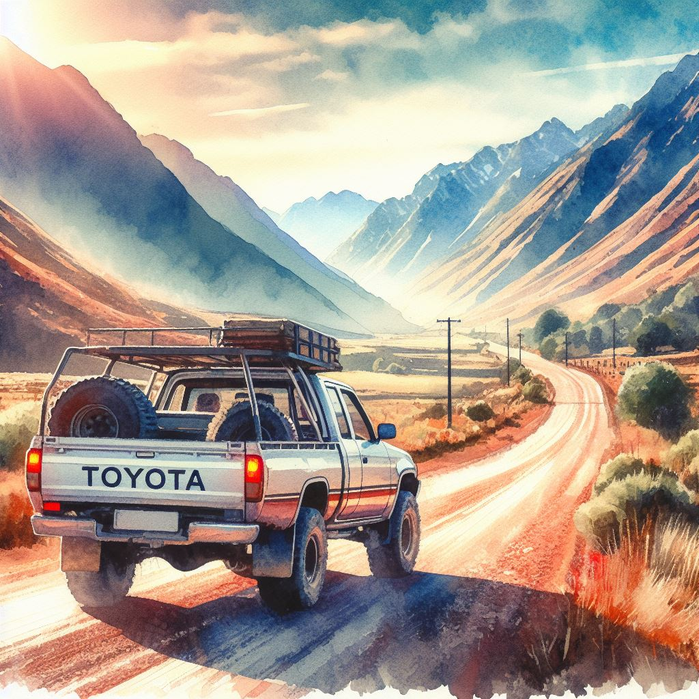
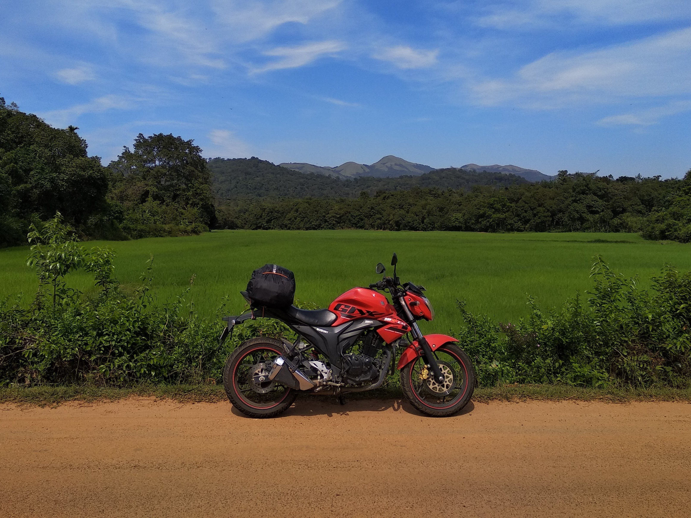
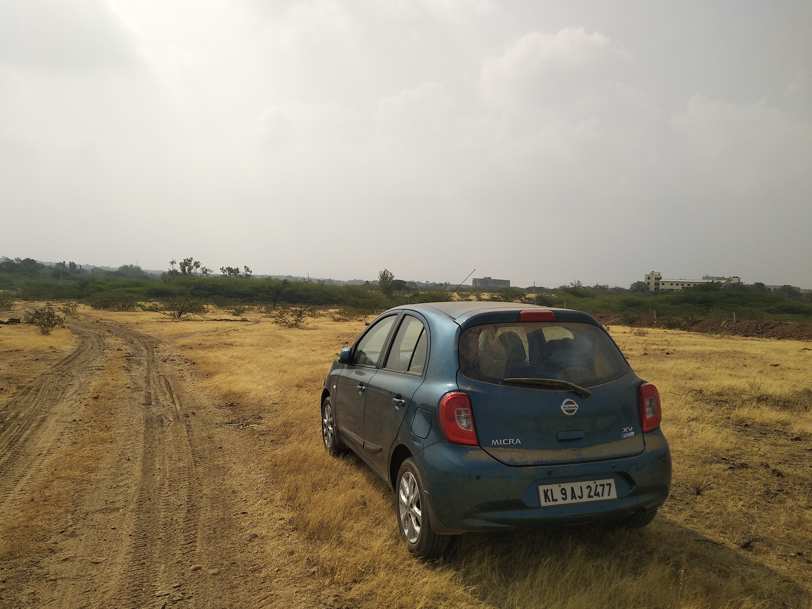
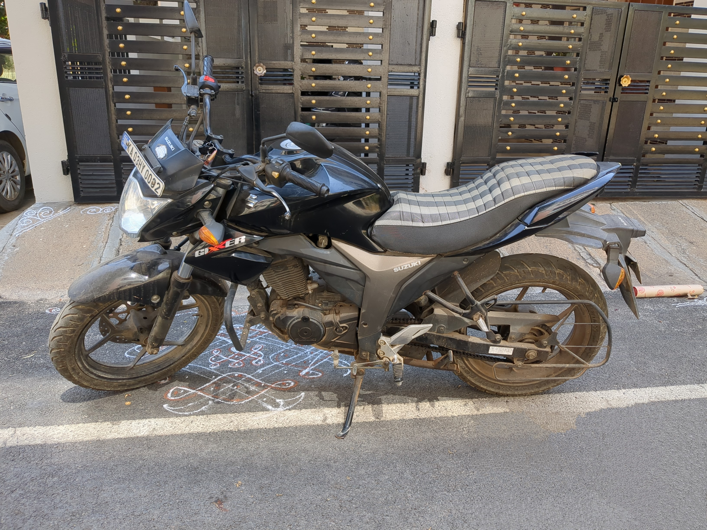

```{r setup, include=FALSE}

library(tidyverse)
library(lubridate)
library(here)
library(glue)
library(kableExtra)
library(googlesheets4) # for G Sheets
library(googledrive) # for G Sheets

i_am("content/sandbox/Vehicle register/index.Rmd")

cur_path <- "content/sandbox/Vehicle register/"

# source(glue("{cur_path}functions.R"))
source("functions.R")


# chunk options
knitr::opts_chunk$set(echo = FALSE, include=FALSE, warnings = FALSE, messages = FALSE)

# hook options (mainly for numbers)
inline_hook <- function(x) {
  if (is.numeric(x)) {
    format(x, scientific = FALSE, big.mark = ",")
  } else x
}
knitr::knit_hooks$set(inline = inline_hook)


# setting up GSheet

drive_auth(email = "rikudoukarthik@gmail.com")
gs4_auth(email = "rikudoukarthik@gmail.com")
our_gsheet <- "https://docs.google.com/spreadsheets/d/1k0FHMT1oXLmtmmBdhgp3NXxKZdkGgbcSu-sRcBMrNJg/edit?usp=sharing"

data_veh <- read_sheet(our_gsheet, 1) %>% 
  mutate(Date = as_date(Date)) %>% 
  magrittr::set_colnames(c("VEHICLE", "DATE", "FUEL.PRICE", "FUEL.QUANT", 
                           "ODO", "DRIVER", "COMMENTS"))

unlogged <- read_sheet(our_gsheet, "Unlogged") %>% 
  magrittr::set_colnames(c("VEHICLE", "DATE", "DISTANCE", "COMMENTS")) %>% 
  group_by(VEHICLE) %>% 
  mutate(TOT.DIST = sum(DISTANCE)) %>% 
  ungroup()

```

```{r summaries, include=FALSE}

### overall ###


# date the vehicle was first taken and last owned (or more accurately filled up)
dates_first_last <- data_veh %>% 
  filter(!is.na(DATE)) %>% 
  group_by(VEHICLE) %>% 
  reframe(DATE.FIRST = min(DATE),
          DATE.LAST = max(DATE))

# first and last odo reading
odo_first_last <- data_veh %>% 
  filter(!is.na(ODO)) %>% 
  group_by(VEHICLE) %>% 
  reframe(ODO.FIRST = min(ODO),
          ODO.LAST = max(ODO))

# other odo stats
odo_stats <- data_veh %>% 
  filter(!is.na(ODO), !is.na(DATE)) %>% 
  group_by(VEHICLE) %>% 
  dplyr::select(DATE, ODO, DRIVER) %>% 
  mutate(ODO.ME = case_when(
    
    # unlogged km in Micra
    DRIVER == "Self" & VEHICLE == "Micra" & DATE == min(DATE) ~ unlogged %>% 
      filter(VEHICLE == "Micra", DATE == "Before") %>% 
      pull(DISTANCE),
    
    DRIVER == "Self" ~ ODO - lag(ODO),
    
    TRUE ~ NA_integer_
  )) %>% 
  mutate(ODO.ME = replace_na(ODO.ME, 0),
         ODO.ME.CUM = cumsum(ODO.ME),
         DRIVER = NULL) %>% 
  ungroup()


data_veh <- data_veh %>% 
  left_join(dates_first_last, by = "VEHICLE") %>% 
  left_join(odo_first_last, by = "VEHICLE") %>% 
  left_join(odo_stats, by = c("VEHICLE", "DATE", "ODO")) %>% 
  mutate(VEHICLE = factor(VEHICLE, 
                          levels = c("Gixxer Rogue", "Micra", "Gixxer 0002")))


# unlogged (inc. Italy scooter)

# total vehicle models driven
# Countries driven in
# years each car driven (later can compare km accummulation vs time)

### individual ###


# 
# Graph of driving over time
# Graph of mileage over time


```

I have loved cars from the time I can remember, whether it was our family cars in which we would spend hours and hours road-tripping across southern Africa, or my little plastic scooter or battery-operated car that I'd rally across our house, much to the annoyance (but occasional amusement) of my parents. Heck, I would even "air drive" both indoors and outdoors, imagining that I was driving the intriguing boxy Toyota Hiace vans that would pick me up and drop me off from school. And even then, I loved noting nerdy tidbits like the total distance air-driven in a day (as if I really understood what a kilometre felt like!).



Much more recently, I have been fortunate enough to actually drive/ride a fair bit myself. And, following my dad's advice, I made it a habit to maintain a fuel log for our own vehicles. I decided it would be fun to collate these datasets and explore some basic yet fun summaries. 

***Note:*** *Page last updated on `r lubridate::today()`, at which time vehicle logs were last updated on `r drive_reveal(our_gsheet, "modified_time") %>% mutate(modified_time = as_date(modified_time)) %>% pull(modified_time)`.*

## Overall stats {.tabset}







```{r, include=TRUE}

table_caption <- glue("My overall driving stats, including exact figures from logged data and approximate figures of unlogged driving in both own and other vehicles.")

# tables of stats
get_overall_stats() %>%
  # mutate(across(everything(), ~ as.character(.))) %>%
  knitr::kable(caption = table_caption, booktabs = TRUE) %>%
  # first column should be bold
  column_spec(1, bold = TRUE, width_min = "15em") %>% 
  column_spec(2:4, width_min = "6em")

```
  





```{r, include=TRUE}

table_caption <- glue("Leaderboard of own vehicles I have driven, based on total distance driven (km). Ranking priority is higher for logged distance than for total, owing to the uncertainty associated with approximation.")

map(unique(data_veh$VEHICLE),
    ~ get_tot_dist(.x) %>% bind_cols(tibble(VEHICLE = .x))) %>% 
  list_rbind() %>% 
  relocate(VEHICLE, TOT.DIST.L, TOT.DIST.U, TOT.DIST) %>% 
  mutate(across(c(TOT.DIST.L, TOT.DIST.U, TOT.DIST),
                ~ str_remove(., ",") %>% as.numeric())) %>% 
  arrange(desc(TOT.DIST.L), desc(TOT.DIST)) %>% 
  mutate(across(c(TOT.DIST.L, TOT.DIST.U, TOT.DIST),
                ~ format(., scientific = FALSE, big.mark = ","))) %>% 
  magrittr::set_colnames(c("Vehicle", "Logged", "Unlogged", "Total")) %>% 
  mutate(Rank = row_number()) %>% 
  relocate(Rank, .before = 1) %>%
  knitr::kable(caption = table_caption, booktabs = TRUE) %>%
  # first row should be bold
  row_spec(1, italic = TRUE)  %>%
  column_spec(2, width_min = "12em") %>% 
  column_spec(c(1, 3:5), width_min = "6em")

```
  





```{r, fig.cap="Graph showing the driving I logged in each vehicle over time. Each point is a fuelling event, when the date, odometer reading, fuel quantity and fuel amount would be logged. Note that Micra does not start from zero, due to the considerable unlogged driving I did in it prior to 2021.", dev.args=list(bg = "transparent"), include=TRUE, warning=FALSE}
data_veh %>% 
  filter(DRIVER == "Self") %>% 
  ggplot(aes(x = DATE, y = ODO.ME.CUM, colour = VEHICLE)) +
  geom_line() +
  geom_point() +
  scale_color_manual(values = c("#FF0000", "#1F968BFF", "black"),
                     name = "Vehicle") +
  scale_x_date(date_breaks = "1 year",
               labels = ~ lubridate::year(.),
               name = "Time") + 
  scale_y_continuous(breaks = seq(0, 50000, 5000),
                     labels = ~ scales::label_comma()(.),
                     name = "Distance I have driven (km)") +
  theme_classic() +
  theme(legend.position = "top",
        panel.grid.major.y = element_line(colour = "darkgrey", linetype = "dotted"),
        panel.background = element_blank(),
        plot.background = element_blank(),
        legend.background = element_blank(),
        legend.box.background = element_blank())
```







## Suzuki Gixxer 150 aka Rogue {#rogue}

Almost immediately after I turned 18, I obtained my driving licence and my first vehicle. Leading up to this, I had already begged and persuaded my dad into gifting me this bike, because I had been itching for a very long time to get on the road myself. 

This was during my undergraduate years, and I did a whole lot of exploration and adventuring with this wonderful bike. As such, it is still very close to my heart, despite having been sold to my good friend before I left in 2019 for my master's in Czechia. 



**Registration**: KL 70 C 6124

**Delivery taken date**: `r dates_first_last %>% filter(VEHICLE == "Gixxer Rogue") %>% pull(DATE.FIRST)`

**Total distance driven**: `r get_tot_dist("Gixxer Rogue") %>% pull(TOT.DIST)` km

**Last odometer reading**: `r data_veh %>% filter(VEHICLE == "Gixxer Rogue", !is.na(ODO)) %>% reframe(ODO = max(ODO)) %>% pull(ODO)` km (when sold)

## Nissan Micra {#micra}

The family car that we first got in 2015. It is unfortunately an automatic (CVT) transmission car, but is the vehicle I have driven the most and the longest, ever since I first starting driving cars. It has also been part of multiple intense birding road trips with me, especially during 2022--23.



**Registration**: KL 09 AJ 2477

**Delivery taken date**: 2015-04-??

**Total distance driven**: `r get_tot_dist("Micra") %>% pull(TOT.DIST)` km

**Last odometer reading**: `r data_veh %>% filter(VEHICLE == "Micra", !is.na(ODO)) %>% reframe(ODO = max(ODO)) %>% pull(ODO)` km

## Suzuki Gixxer 150 aka 0002 {#0002}

The first vehicle I purchased myself (with a loan from my dad that I paid off in instalments). My love for the Suzuki engine on this bike, and the sentimentality of Rogue together simplified my choice of bike this time around. Bought used after I returned to Bangalore from Czechia, the primary job description of this bike was commuting. Neither its previous owner nor I have shown it much of the country besides the Bangalore metropolitan area.

*Interestingly, the vehicle's registration number was a random draw---the previous owner did not pay to get the fancy number. It's rather fitting, since this is also my second Gixxer!*



**Registration**: KA 03 HY 0002

**Delivery taken date**: `r dates_first_last %>% filter(VEHICLE == "Gixxer 0002") %>% pull(DATE.FIRST)`

**Total distance driven**: `r get_tot_dist("Gixxer 0002") %>% pull(TOT.DIST)` km

**Last odometer reading**: `r data_veh %>% filter(VEHICLE == "Gixxer 0002", !is.na(ODO)) %>% reframe(ODO = max(ODO)) %>% pull(ODO)` km
