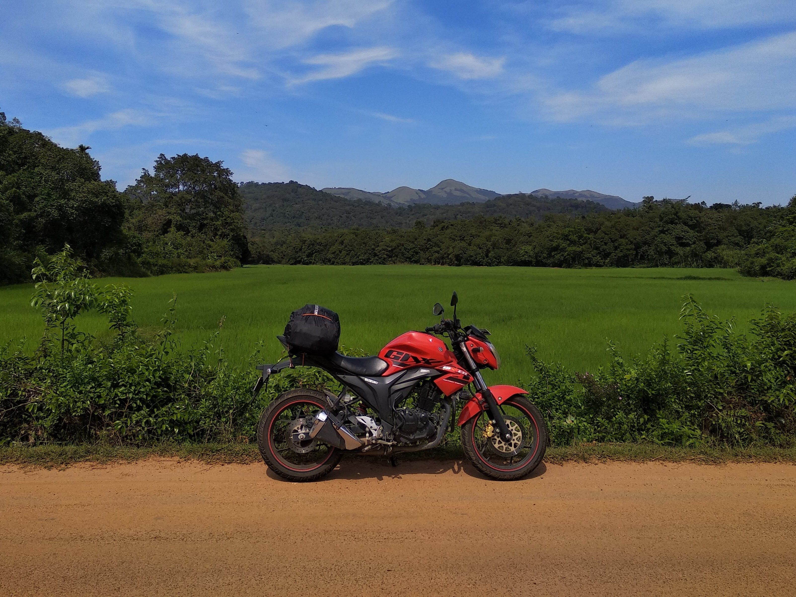

<link href="index_files/lightable/lightable.css" rel="stylesheet" />

<link href="index_files/lightable/lightable.css" rel="stylesheet" />

I have loved cars from the time I can remember, whether it was our family cars in which we would spend hours and hours road-tripping across southern Africa, or my little plastic scooter or battery-operated car that I'd rally across our house, much to the annoyance (but occasional amusement) of my parents. Heck, I would even "air drive" both indoors and outdoors, imagining that I was driving the intriguing boxy Toyota Hiace vans that would pick me up and drop me off from school. And even then, I loved noting nerdy tidbits like the total distance air-driven in a day (as if I really understood what a kilometre felt like!).

Much more recently, I have been fortunate enough to actually drive/ride a fair bit myself. And, following my dad's advice, I made it a habit to maintain a fuel log for our own vehicles. I decided it would be fun to collate these datasets and explore some basic yet fun summaries. 

***Note:*** *Page last updated on 2025-07-06, at which time vehicle logs were last updated on 2025-07-07.*

## Overall stats {.tabset}





<table>
<caption>Table 1: (\#tab:unnamed-chunk-1)My overall driving stats, including exact figures from logged data and approximate figures of unlogged driving in both own and other vehicles.</caption>
 <thead>
  <tr>
   <th style="text-align:left;">  </th>
   <th style="text-align:left;"> Logged </th>
   <th style="text-align:left;"> Unlogged </th>
   <th style="text-align:left;"> Total </th>
  </tr>
 </thead>
<tbody>
  <tr>
   <td style="text-align:left;min-width: 15em; font-weight: bold;"> Distance driven (km) </td>
   <td style="text-align:left;min-width: 6em; "> 45,068 </td>
   <td style="text-align:left;min-width: 6em; "> 15,000 </td>
   <td style="text-align:left;min-width: 6em; "> 60,068 </td>
  </tr>
</tbody>
</table>
  




<table>
<caption>Table 3: (\#tab:unnamed-chunk-2)Leaderboard of own vehicles I have driven, based on total distance driven (km). Ranking priority is higher for logged distance than for total, owing to the uncertainty associated with approximation.</caption>
 <thead>
  <tr>
   <th style="text-align:right;"> Rank </th>
   <th style="text-align:left;"> Vehicle </th>
   <th style="text-align:left;"> Logged </th>
   <th style="text-align:left;"> Unlogged </th>
   <th style="text-align:left;"> Total </th>
  </tr>
 </thead>
<tbody>
  <tr>
   <td style="text-align:right;font-style: italic;min-width: 6em; "> 1 </td>
   <td style="text-align:left;font-style: italic;min-width: 12em; "> Gixxer Rogue </td>
   <td style="text-align:left;font-style: italic;min-width: 6em; "> 20,772 </td>
   <td style="text-align:left;font-style: italic;min-width: 6em; "> 0 </td>
   <td style="text-align:left;font-style: italic;min-width: 6em; "> 20,772 </td>
  </tr>
  <tr>
   <td style="text-align:right;min-width: 6em; "> 2 </td>
   <td style="text-align:left;min-width: 12em; "> Micra </td>
   <td style="text-align:left;min-width: 6em; "> 20,432 </td>
   <td style="text-align:left;min-width: 6em; "> 10,000 </td>
   <td style="text-align:left;min-width: 6em; "> 30,432 </td>
  </tr>
  <tr>
   <td style="text-align:right;min-width: 6em; "> 3 </td>
   <td style="text-align:left;min-width: 12em; "> Gixxer 0002 </td>
   <td style="text-align:left;min-width: 6em; "> 3,864 </td>
   <td style="text-align:left;min-width: 6em; "> 0 </td>
   <td style="text-align:left;min-width: 6em; "> 3,864 </td>
  </tr>
</tbody>
</table>
  




}}index_files/figure-html/unnamed-chunk-3-1.png" alt="Graph showing the driving I logged in each vehicle over time. Each point is a fuelling event, when the date, odometer reading, fuel quantity and fuel amount would be logged. Note that Micra does not start from zero, due to the considerable unlogged driving I did in it prior to 2021." width="672" />

Figure 1: Graph showing the driving I logged in each vehicle over time. Each point is a fuelling event, when the date, odometer reading, fuel quantity and fuel amount would be logged. Note that Micra does not start from zero, due to the considerable unlogged driving I did in it prior to 2021.





## Suzuki Gixxer 150 aka Rogue {#rogue}

Almost immediately after I turned 18, I obtained my driving licence and my first vehicle. Leading up to this, I had already begged and persuaded my dad into gifting me this bike, because I had been itching for a very long time to get on the road myself. 

This was during my undergraduate years, and I did a whole lot of exploration and adventuring with this wonderful bike. As such, it is still very close to my heart, despite having been sold to my good friend before I left in 2019 for my master's in Czechia. 

**Registration**: KL 70 C 6124

**Delivery taken date**: 2017-10-21

**Total distance driven**: 20,772 km

**Last odometer reading**: 20,776 km (when sold)

## Nissan Micra {#micra}

The family car that we first got in 2015. It is unfortunately an automatic (CVT) transmission car, but is the vehicle I have driven the most and the longest, ever since I first starting driving cars. It has also been part of multiple intense birding road trips with me, especially during 2022--23.

**Registration**: KL 09 AJ 2477

**Delivery taken date**: 2015-04-??

**Total distance driven**: 30,432 km

**Last odometer reading**: 87,840 km

## Suzuki Gixxer 150 aka 0002 {#0002}

The first vehicle I purchased myself (with a loan from my dad that I paid off in instalments). My love for the Suzuki engine on this bike, and the sentimentality of Rogue together simplified my choice of bike this time around. Bought used after I returned to Bangalore from Czechia, the primary job description of this bike was commuting. Neither its previous owner nor I have shown it much of the country besides the Bangalore metropolitan area.

*Interestingly, the vehicle's registration number was a random draw---the previous owner did not pay to get the fancy number. It's rather fitting, since this is also my second Gixxer!*

**Registration**: KA 03 HY 0002

**Delivery taken date**: 2021-10-28

**Total distance driven**: 3,864 km

**Last odometer reading**: 44,650 km
